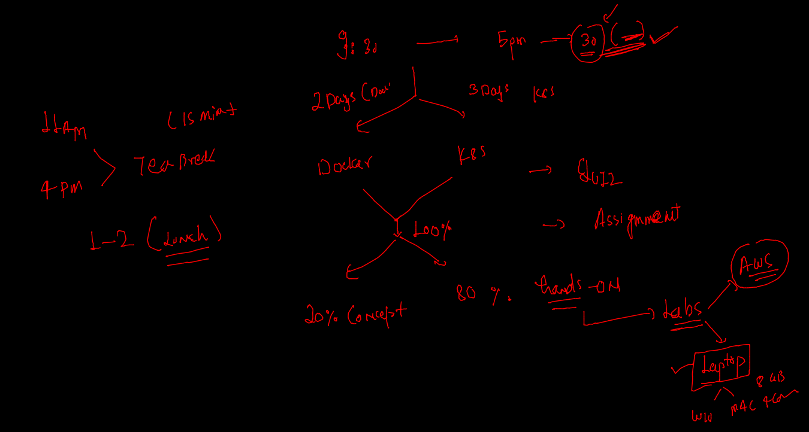
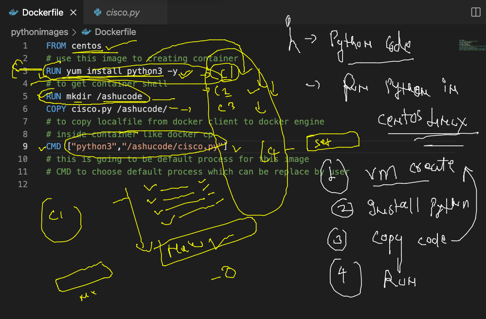
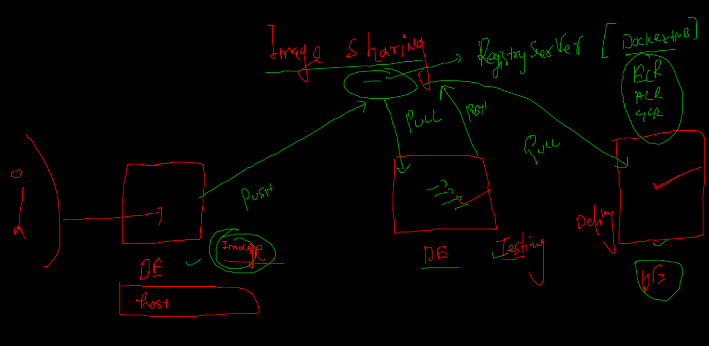
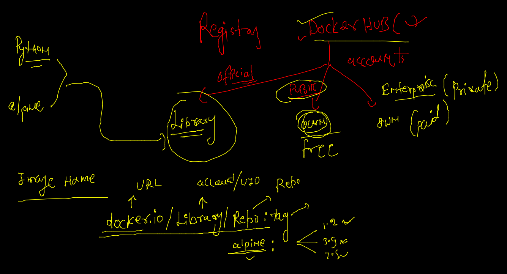
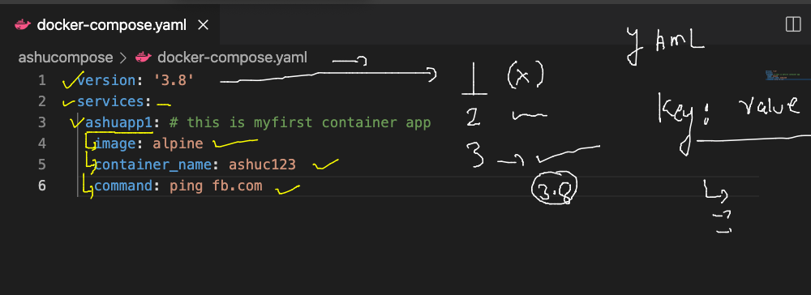

# Plan of traning --



### tip to remove images and containers (ALL)

```
120  docker  rm $(docker ps -qa) -f
  121  docker rmi $(docker  images -q) -f

```

## building docker image --



### image new --

```
cd pythonimages/
[ashu@ip-172-31-29-84 pythonimages]$ ls
cisco.py  Dockerfile
[ashu@ip-172-31-29-84 pythonimages]$ docker build -t ashupython:v1 . 
Sending build context to Docker daemon  3.072kB
Step 1/5 : FROM fedora
 ---> b78af7a83692
Step 2/5 : RUN dnf install python3 -y
 ---> Running in c58458ed9d16
Fedora 35 - x86_64                               18 MB/s |  79 MB     00:04    
Fedora 35 openh264 (From Cisco) - x86_64        7.0 kB/s | 2.5 kB     00:00    
Fedora Modular 35 - x86_64                      8.9 MB/s | 3.3 MB     00:00    
Fedora 35 - x86_64 - Updates                     18 MB/s |  22 MB     00:01    
Fedora Modular 35 - x86_64 - Updates            9.8 MB/s | 2.8 MB     00:00    
Last metadata expiration check: 0:00:01 ago on Tue Feb  1 05:18:18 2022.
Package python3-3.10.0-1.fc35.x86_64 is already installed.
Dependencies resolved.
Nothing to do.
Complete!
Removing intermediate container c58458ed9d16
 ---> 18f3eca86b44
Step 3/5 : RUN mkdir /ashucode
 ---> Running in c7489cf48536
Removing intermediate container c7489cf48536
 ---> b22f648c2a04
Step 4/5 : COPY cisco.py /ashucode/
 ---> c02f956484db
Step 5/5 : CMD ["python3","/ashucode/cisco.py"]
 ---> Running in 5a3cbefb75e2
Removing intermediate container 5a3cbefb75e2
 ---> 2ff68235df68
Successfully built 2ff68235df68
Successfully tagged ashupython:v1

```

### building 

```
$ ls
cisco.py  Dockerfile  official.dockerfile
[ashu@ip-172-31-29-84 pythonimages]$ docker build -t ashupython:v2  -f  official.dockerfile  . 
Sending build context to Docker daemon  4.096kB
Step 1/4 : FROM python
 ---> e2e732b7951f
Step 2/4 : RUN mkdir /ashucode
 ---> Running in a5f194a80464
Removing intermediate container a5f194a80464
 ---> 175e88f6f760
Step 3/4 : COPY cisco.py /ashucode/

```

### creating container --

```
 149  docker run  -it  -d --name  ashupyc1  ashupython:v1  
  150  docker  ps
  151  docker  stats
  152  history 
[ashu@ip-172-31-29-84 pythonimages]$ docker  ps
CONTAINER ID   IMAGE            COMMAND                  CREATED          STATUS          PORTS     NAMES
6cfb0ab04391   anilapython:v2   "python3 /anilacode/…"   8 seconds ago    Up 7 seconds              anila2
10c0405d0900   anilapython:v1   "python3 /anilacode/…"   18 seconds ago   Up 17 seconds             anila1
c0c707e1a321   ashupython:v1    "python3 /ashucode/c…"   38 seconds ago   Up 37 seconds             ashupyc1

```
### images sharing with container registry 



### image format to push in docker hub 



### pushing image to docker hub 

```
[ashu@ip-172-31-29-84 pythonimages]$ docker  images   |  grep -i ashu
ashupython          v2          033a4eb76f0e   About an hour ago   886MB
ashupython          v1          2ff68235df68   About an hour ago   391MB
[ashu@ip-172-31-29-84 pythonimages]$ 
[ashu@ip-172-31-29-84 pythonimages]$ 
[ashu@ip-172-31-29-84 pythonimages]$ docker  tag   ashupython:v1   docker.io/dockerashu/ciscopython:pyfeb12022 
[ashu@ip-172-31-29-84 pythonimages]$ 
[ashu@ip-172-31-29-84 pythonimages]$ 
[ashu@ip-172-31-29-84 pythonimages]$ docker  images   |  grep -i ashu
ashupython               v2           033a4eb76f0e   About an hour ago   886MB
dockerashu/ciscopython   pyfeb12022   2ff68235df68   About an hour ago   391MB
ashupython               v1           2ff68235df68   About an hour ago   391MB
[ashu@ip-172-31-29-84 pythonimages]$ 
[ashu@ip-172-31-29-84 pythonimages]$ docker  login  
Login with your Docker ID to push and pull images from Docker Hub. If you don't have a Docker ID, head over to https://hub.docker.com to create one.
Username: dockerashu
Password: 
WARNING! Your password will be stored unencrypted in /home/ashu/.docker/config.json.
Configure a credential helper to remove this warning. See
https://docs.docker.com/engine/reference/commandline/login/#credentials-store

Login Succeeded
[ashu@ip-172-31-29-84 pythonimages]$ docker  push     dockerashu/ciscopython:pyfeb12022 
The push refers to repository [docker.io/dockerashu/ciscopython]
1828ab6bff53: Pushed 
b623d36cc2bd: Pushed 
f0ea5f780d7c: Pushed 
389adea752cd: Mounted from library/fedora 
pyfeb12022: digest: sha256:6db5b0efe8fb3ce7d83b4a0b0d0597864c327e0c3ddb172ce62ab4179b8b90c3 size: 1156
[ashu@ip-172-31-29-84 pythonimages]$ 
[ashu@ip-172-31-29-84 pythonimages]$ docker  logout 
Removing login credentials for https://index.docker.io/v1/

```

### pulling image from a different docker client -

```

 fire@ashutoshhs-MacBook-Air  ~  docker  pull  dockerashu/ciscopython:pyfeb12022 
pyfeb12022: Pulling from dockerashu/ciscopython
edad61c68e67: Extracting  8.356MB/54.65MB
9504d90bef65: Downloading  87.02MB/190MB
b128e8c540e3: Download complete 
88df88746666: Download complete 


```

## Docker compose -- 


## installation --

[compsoe install](https://docs.docker.com/compose/install/)

### compsoe file 1



### running compose file 

```

[ashu@ip-172-31-29-84 myimages]$ cd  ashucompose/
[ashu@ip-172-31-29-84 ashucompose]$ ls
docker-compose.yaml
[ashu@ip-172-31-29-84 ashucompose]$ docker-compose  up  -d 
Creating network "ashucompose_default" with the default driver
Creating ashuc123 ... done
[ashu@ip-172-31-29-84 ashucompose]$ docker-compose  ps
  Name       Command     State   Ports
--------------------------------------
ashuc123   ping fb.com   Up           
[ashu@ip-172-31-29-84 ashucompose]$ docker-compose images
Container   Repository    Tag       Image Id       Size  
---------------------------------------------------------
ashuc123    alpine       latest   c059bfaa849c   5.586 MB

```

### compose more commands 

```
197  docker-compose  up  -d 
  198  docker-compose  ps
  199  docker-compose images
  200  docker-compose  ps
  201  ls
  202  docker-compose  stop
  203  docker-compose  ps
  204  docker-compose  start
  205  docker-compose  ps
  206  history 
[ashu@ip-172-31-29-84 ashucompose]$ ls
docker-compose.yaml
[ashu@ip-172-31-29-84 ashucompose]$ docker-compose  ps
  Name       Command     State   Ports
--------------------------------------
ashuc123   ping fb.com   Up           
[ashu@ip-172-31-29-84 ashucompose]$ docker-compose  stop
Stopping ashuc123 ... done
[ashu@ip-172-31-29-84 ashucompose]$ docker-compose  rm
Going to remove ashuc123
Are you sure? [yN] y
Removing ashuc123 ... done

```

### up and down 

```
 
[ashu@ip-172-31-29-84 ashucompose]$ docker-compose up -d
Creating network "ashucompose_default" with the default driver
Creating ashuc123 ... done
[ashu@ip-172-31-29-84 ashucompose]$ 
[ashu@ip-172-31-29-84 ashucompose]$ 
[ashu@ip-172-31-29-84 ashucompose]$ docker-compose  down 
Stopping ashuc123 ... done
Removing ashuc123 ... done
Removing network ashucompose_default

```

### compose example --

```
version: '3.8'
services:
 ashuapp3:
  image: ashupython:v1111
  build:
   context: ../pythonimages
   dockerfile: alpine.dockerfile
  container_name: ashualpc11
  
 ashuapp2: 
  image: ashupython:v1
  container_name: ashupyc11

 ashuapp1: # this is myfirst container app
  image: alpine
  container_name: ashuc123
  command: ping fb.com 


# docker run -itd --name ashuc123 alpine ping fb.com 

```

