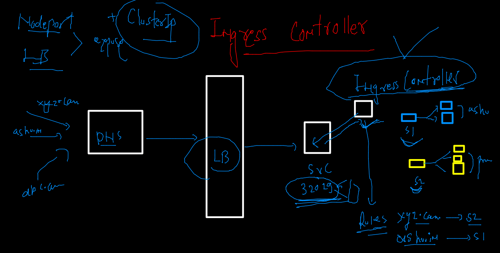
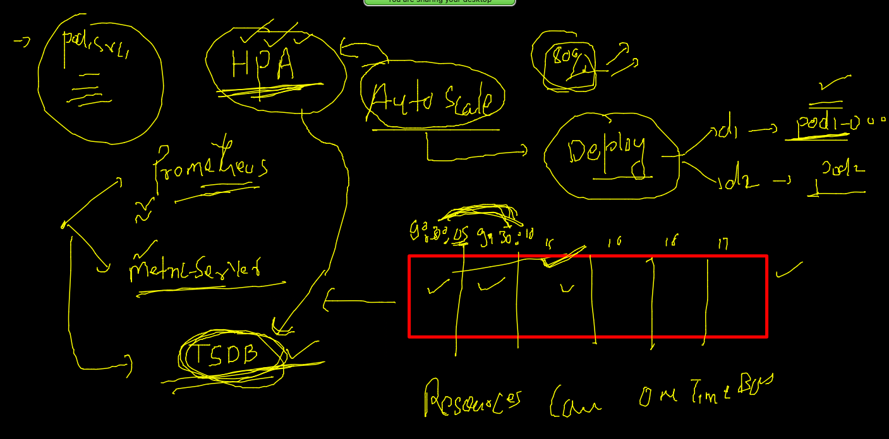

# Plan of traning --


## Deployment 

### creating 
```
kubectl  create deployment  ashuweb  --image=dockerashu/cisco:feb32022  --dry-run=client -o yaml  

```

### deploy yaml and check self healing 

```
 kubectl apply -f  newapp.yaml 
deployment.apps/ashuweb created
[ashu@ip-172-31-29-84 depoyapps]$ kubectl   get deployment 
NAME      READY   UP-TO-DATE   AVAILABLE   AGE
ashuweb   1/1     1            1           5s
[ashu@ip-172-31-29-84 depoyapps]$ kubectl   get deploy
NAME      READY   UP-TO-DATE   AVAILABLE   AGE
ashuweb   1/1     1            1           8s
[ashu@ip-172-31-29-84 depoyapps]$ kubectl   get   pod
NAME                      READY   STATUS    RESTARTS   AGE
ashuweb-87ffb8cb8-zrglc   1/1     Running   0          24s
[ashu@ip-172-31-29-84 depoyapps]$ kubectl   get   pod -o wide
NAME                      READY   STATUS    RESTARTS   AGE   IP                NODE    NOMINATED NODE   READINESS GATES
ashuweb-87ffb8cb8-zrglc   1/1     Running   0          30s   192.168.166.141   node1   <none>           <none>
[ashu@ip-172-31-29-84 depoyapps]$ kubectl  delete pod ashuweb-87ffb8cb8-zrglc
pod "ashuweb-87ffb8cb8-zrglc" deleted
[ashu@ip-172-31-29-84 depoyapps]$ kubectl   get   pod -o wide
NAME                      READY   STATUS    RESTARTS   AGE   IP               NODE    NOMINATED NODE   READINESS GATES
ashuweb-87ffb8cb8-q7sqw   1/1     Running   0          59s   192.168.104.26   node2   <none>           <none>

```

### checking  container ip inside POD 

```
kubectl  exec -it  ashuweb-87ffb8cb8-q7sqw  -- bash 
[root@ashuweb-87ffb8cb8-q7sqw common]# 
[root@ashuweb-87ffb8cb8-q7sqw common]# ifconfig 
eth0: flags=4163<UP,BROADCAST,RUNNING,MULTICAST>  mtu 8981
        inet 192.168.104.26  netmask 255.255.255.255  broadcast 0.0.0.0
        ether e2:77:cf:46:15:e5  txqueuelen 0  (Ethernet)
        RX packets 728  bytes 3570803 (3.4 MiB)
        RX errors 0  dropped 0  overruns 0  frame 0
        TX packets 648  bytes 65441 (63.9 KiB)
        TX errors 0  dropped 0 overruns 0  carrier 0  collisions 0

lo: flags=73<UP,LOOPBACK,RUNNING>  mtu 65536
        inet 127.0.0.1  netmask 255.0.0.0
        loop  txqueuelen 1000  (Local Loopback)
        RX packets 0  bytes 0 (0.0 B)
        RX errors 0  dropped 0  overruns 0  frame 0
        TX packets 0  bytes 0 (0.0 B)
        TX errors 0  dropped 0 overruns 0  carrier 0  collisions 0

[root@ashuweb-87ffb8cb8-q7sqw common]# yum  install net-tools -y

```

### scaling of pod using deployment 


### manual scaling 

```
 kubectl scale deployment   ashuweb  --replicas=3
deployment.apps/ashuweb scaled
[ashu@ip-172-31-29-84 depoyapps]$ kubectl  get pods
NAME                      READY   STATUS    RESTARTS   AGE
ashuweb-87ffb8cb8-8zj5j   1/1     Running   0          13s
ashuweb-87ffb8cb8-lrmk4   1/1     Running   0          13s
ashuweb-87ffb8cb8-q7sqw   1/1     Running   0          9m20s
[ashu@ip-172-31-29-84 depoyapps]$ kubectl  get pods -o wide
NAME                      READY   STATUS    RESTARTS   AGE     IP                NODE    NOMINATED NODE   READINESS GATES
ashuweb-87ffb8cb8-8zj5j   1/1     Running   0          34s     192.168.166.142   node1   <none>           <none>
ashuweb-87ffb8cb8-lrmk4   1/1     Running   0          34s     192.168.135.30    node3   <none>           <none>
ashuweb-87ffb8cb8-q7sqw   1/1     Running   0          9m41s   192.168.104.26    node2   <none>           <none>

```

### all the pods will have same label by deployment 

```
 kubectl  get pods --show-labels
NAME                      READY   STATUS    RESTARTS   AGE     LABELS
ashuweb-87ffb8cb8-8zj5j   1/1     Running   0          4m53s   app=ashuweb,pod-template-hash=87ffb8cb8
ashuweb-87ffb8cb8-lrmk4   1/1     Running   0          4m53s   app=ashuweb,pod-template-hash=87ffb8cb8
ashuweb-87ffb8cb8-q7sqw   1/1     Running   0          14m     app=ashuweb,pod-template-hash=87ffb8cb8

```

### creating service using expose 

```
kubectl  get  deploy 
NAME      READY   UP-TO-DATE   AVAILABLE   AGE
ashuweb   3/3     3            3           17m
[ashu@ip-172-31-29-84 depoyapps]$ 
[ashu@ip-172-31-29-84 depoyapps]$ kubectl  expose  deploy  ashuweb --type NodePort  --port 80 --name  ashusvc1 
service/ashusvc1 exposed
[ashu@ip-172-31-29-84 depoyapps]$ kubectl  get  svc
NAME       TYPE       CLUSTER-IP       EXTERNAL-IP   PORT(S)        AGE
ashusvc1   NodePort   10.107.242.181   <none>        80:32026/TCP   22s

```

### Dashboard deployment in k8s

```
kubectl apply -f https://raw.githubusercontent.com/kubernetes/dashboard/v2.4.0/aio/deploy/recommended.yaml
namespace/kubernetes-dashboard created
serviceaccount/kubernetes-dashboard created

```
### changing service type 

```
kubectl get deploy -n kubernetes-dashboard
NAME                        READY   UP-TO-DATE   AVAILABLE   AGE
dashboard-metrics-scraper   1/1     1            1           68s
kubernetes-dashboard        1/1     1            1           70s
 fire@ashutoshhs-MacBook-Air  ~/Desktop  
 fire@ashutoshhs-MacBook-Air  ~/Desktop  
 fire@ashutoshhs-MacBook-Air  ~/Desktop  
 fire@ashutoshhs-MacBook-Air  ~/Desktop  kubectl get po  -n kubernetes-dashboard
NAME                                         READY   STATUS    RESTARTS   AGE
dashboard-metrics-scraper-799d786dbf-gkfd4   1/1     Running   0          83s
kubernetes-dashboard-6b6b86c4c5-26mqt        1/1     Running   0          84s
 fire@ashutoshhs-MacBook-Air  ~/Desktop  kubectl get svc  -n kubernetes-dashboard
NAME                        TYPE        CLUSTER-IP       EXTERNAL-IP   PORT(S)    AGE
dashboard-metrics-scraper   ClusterIP   10.101.132.132   <none>        8000/TCP   95s
kubernetes-dashboard        ClusterIP   10.97.24.66      <none>        443/TCP    104s
 fire@ashutoshhs-MacBook-Air  ~/Desktop  kubectl edit svc  kubernetes-dashboard    -n kubernetes-dashboard
service/kubernetes-dashboard edited
 fire@ashutoshhs-MacBook-Air  ~/Desktop  kubectl get svc  -n kubernetes-dashboard                         
NAME                        TYPE        CLUSTER-IP       EXTERNAL-IP   PORT(S)         AGE
dashboard-metrics-scraper   ClusterIP   10.101.132.132   <none>        8000/TCP        2m21s
kubernetes-dashboard        NodePort    10.97.24.66      <none>        443:31736/TCP   2m30s

```

### getting dashboard auth token 

### understanding secret 


### getting dashboard secret 

```
 kubectl   get  sa  -n  kubernetes-dashboard
NAME                   SECRETS   AGE
default                1         19m
kubernetes-dashboard   1         19m
[ashu@ip-172-31-29-84 depoyapps]$ kubectl   get  secret  -n  kubernetes-dashboard
NAME                               TYPE                                  DATA   AGE
default-token-mvg7t                kubernetes.io/service-account-token   3      20m
kubernetes-dashboard-certs         Opaque                                0      20m
kubernetes-dashboard-csrf          Opaque                                1      20m
kubernetes-dashboard-key-holder    Opaque                                2      20m
kubernetes-dashboard-token-h9fnq   kubernetes.io/service-account-token   3      20m
[ashu@ip-172-31-29-84 depoyapps]$ kubectl  describe  secret  kubernetes-dashboard-token-h9fnq  -n  kubernetes-dashboard 

```
### NP and LB svc 

```
kubectl expose deploy ashuweb   --type LoadBalancer  --port 80 --name ashusvc2
service/ashusvc2 exposed
[ashu@ip-172-31-29-84 myimages]$ kubectl  get  svc 
NAME       TYPE           CLUSTER-IP       EXTERNAL-IP   PORT(S)        AGE
ashusvc1   NodePort       10.107.242.181   <none>        80:32026/TCP   102m
ashusvc2   LoadBalancer   10.101.158.125   <pending>     80:32043/TCP   5s
[ashu@ip-172-31-29-84 myimages]$ kubectl  get  svc 
NAME       TYPE           CLUSTER-IP       EXTERNAL-IP   PORT(S)        AGE
ashusvc1   NodePort       10.107.242.181   <none>        80:32026/TCP   104m
ashusvc2   LoadBalancer   10.101.158.125   <pending>     80:32043/TCP   2m39s
```

## Multiple app LB are not required we can use Ingress controller --



### deploy Ingress --

```
kubectl apply -f https://raw.githubusercontent.com/redashu/k8s/ssl/nginx-ingress-controller.yamlnamespace/ingress-nginx created
serviceaccount/ingress-nginx created
```

## Micros service example 

### Home page deployment --

```
kubectl  create  deployment  ashuhome  --image=dockerashu/ciscowebapp:homepage   --dry-run=client -o yaml  >home.yaml
```

### --

```
 kubectl apply -f home.yaml 
deployment.apps/ashuhome created
[ashu@ip-172-31-29-84 depoyapps]$ kubectl  get  deploy 
NAME       READY   UP-TO-DATE   AVAILABLE   AGE
ashuhome   0/1     1            0           6s
[ashu@ip-172-31-29-84 depoyapps]$ kubectl  get  deploy 
NAME       READY   UP-TO-DATE   AVAILABLE   AGE
ashuhome   1/1     1            1           11s
[ashu@ip-172-31-29-84 depoyapps]$ kubectl  get po 
NAME                        READY   STATUS    RESTARTS   AGE
ashuhome-75cf5dcbc8-xh44w   1/1     Running   0          15s

```

### expose service 

```
kubectl  get  deploy 
NAME       READY   UP-TO-DATE   AVAILABLE   AGE
ashuhome   1/1     1            1           105s
 fire@ashutoshhs-MacBook-Air  ~/Desktop  kubectl  expose deploy ashuhome  --type NodePort --port 80 --name homesvc --dry-run=client  -o yaml 
apiVersion: v1
kind: Service
metadata:
  creationTimestamp: null
  labels:
    app: ashuhome

```

### creating service 

```
 kubectl  apply -f home.yaml 
deployment.apps/ashuhome configured
service/homesvc created
[ashu@ip-172-31-29-84 depoyapps]$ kubectl  get deploy 
NAME       READY   UP-TO-DATE   AVAILABLE   AGE
ashuhome   1/1     1            1           4m30s
[ashu@ip-172-31-29-84 depoyapps]$ kubectl  get svc
NAME      TYPE       CLUSTER-IP      EXTERNAL-IP   PORT(S)        AGE
homesvc   NodePort   10.109.46.254   <none>        80:30691/TCP   13s
```

### INgress rules 


### checking all api-resources for reference 

```
kubectl  api-resources  
NAME                              SHORTNAMES   APIVERSION                             NAMESPACED   KIND
bindings                                       v1                                     true         Binding
componentstatuses                 cs           v1                                     false        ComponentStatus
configmaps                        cm           v1                                     true         ConfigMap
endpoints                         ep           v1                                     true         Endpoints
events                            ev           v1                                     true         Event
limitranges                       limits       v1                                     true         LimitRange
namespaces                        ns           v1          

```

### rule creation 

```
 kubectl  apply -f  home.yaml 
deployment.apps/ashuhome configured
service/homesvc configured
ingress.networking.k8s.io/ashuapp-rule created
[ashu@ip-172-31-29-84 depoyapps]$ kubectl   get  ingress
NAME           CLASS   HOSTS                ADDRESS        PORTS   AGE
ashuapp-rule   nginx   cisco.ashutoshh.in   172.31.29.26   80      7s
```
### Minikube based setup / switching between cluster 

```
10075  minikube version 
10076  minikube start  --driver=docker 
10077  kubectl  get  nodes
10078  kubectl  get  ns
 fire@ashutoshhs-MacBook-Air  ~/Desktop  minikube status
minikube
type: Control Plane
host: Running
kubelet: Running
apiserver: Running
kubeconfig: Configured

 fire@ashutoshhs-MacBook-Air  ~/Desktop  kubectl get nodes
NAME       STATUS   ROLES                  AGE   VERSION
minikube   Ready    control-plane,master   26m   v1.23.1
 fire@ashutoshhs-MacBook-Air  ~/Desktop  
 fire@ashutoshhs-MacBook-Air  ~/Desktop  
 fire@ashutoshhs-MacBook-Air  ~/Desktop  kubectl config get-contexts 
CURRENT   NAME                          CLUSTER      AUTHINFO           NAMESPACE
          kubernetes-admin@kubernetes   kubernetes   kubernetes-admin   ashu-space
*         minikube                      minikube     minikube           default
 fire@ashutoshhs-MacBook-Air  ~/Desktop  kubectl  config use-context  kubernetes-admin@kubernetes
Switched to context "kubernetes-admin@kubernetes".
 fire@ashutoshhs-MacBook-Air  ~/Desktop  kubectl config get-contexts                             
CURRENT   NAME                          CLUSTER      AUTHINFO           NAMESPACE
*         kubernetes-admin@kubernetes   kubernetes   kubernetes-admin   ashu-space
          minikube                      minikube     minikube           default
 fire@ashutoshhs-MacBook-Air  ~/Desktop  kubectl  get  nodes
NAME         STATUS   ROLES                  AGE    VERSION
masternode   Ready    control-plane,master   2d2h   v1.23.3
node1        Ready    <none>                 2d2h   v1.23.3
node2        Ready    <none>                 2d2h   v1.23.3
node3        Ready    <none>                 2d2h   v1.23.3
```

### HPA in k8s 


### Deploy metric server for HPA support 

```
kubectl  apply -f  https://raw.githubusercontent.com/redashu/k8s/hpa/hpa/components.yaml
serviceaccount/metrics-server created
clusterrole.rbac.authorization.k8s.io/system:aggregated-metrics-reader created
clusterrole.rbac.authorization.k8s.io/system:metrics-server created
rolebinding.rbac.authorization.k8s.io/metrics-server-auth-reader created
clusterrolebinding.rbac.authorization.k8s.io/metrics-server:system:auth-delegator created
clusterrolebinding.rbac.authorization.k8s.io/system:metrics-server created
service/metrics-server created
deployment.apps/metrics-server created
apiservice.apiregistration.k8s.io/v1beta1.metrics.k8s.io created
```

### HPA rule 

```
kubectl  get  deploy 
NAME          READY   UP-TO-DATE   AVAILABLE   AGE
ashuconnect   1/1     1            1           117m
ashuhome      1/1     1            1           138m
[ashu@ip-172-31-29-84 depoyapps]$ kubectl  get  hpa
No resources found in ashu-space namespace.
[ashu@ip-172-31-29-84 depoyapps]$ kubectl  autoscale deploy ashuhome  --min=3 --max=20  --cpu-percent=80 
horizontalpodautoscaler.autoscaling/ashuhome autoscaled
[ashu@ip-172-31-29-84 depoyapps]$ kubectl  get  deploy 
NAME          READY   UP-TO-DATE   AVAILABLE   AGE
ashuconnect   1/1     1            1           118m
ashuhome      1/1     1            1           140m
[ashu@ip-172-31-29-84 depoyapps]$ kubectl  get  deploy 
NAME          READY   UP-TO-DATE   AVAILABLE   AGE
ashuconnect   1/1     1            1           119m
ashuhome      1/1     1            1           140m

```

### k8s command history 

```
 kubectl   apply -f  ashuwebpod.yaml 
  415  kubectl   get pods
  416  kubectl   apply -f  ashuwebpod.yaml 
  417  kubectl   get pods
  418  kubectl  get  no
  419  kubectl get po -o wide
  420  kubectl  run   hellopod --image=dockerashu/cisco:feb32022  --port 80 --dry-run=client -o yaml 
  421  history 
  422  kubectl  delete pod --all
  423  kubectl  run   hellopod --image=dockerashu/cisco:feb32022  --port 80 --dry-run=client -o json 
  424  history 
  425  kubectl  run   hellopod --image=dockerashu/cisco:feb32022  --port 80 --dry-run=client -o yaml   >autopod.yaml 
  426  kubectl  run   hellopod --image=dockerashu/cisco:feb32022  --port 80 --dry-run=client -o json   >webpod.json 
  427  history 
  428  ls
  429  kubectl apply -f  autopod.yaml 
  430  kubectl  get pods
  431  history 
  432  kubectl  get  pods
  433  history 
  434  kubectl  get  pods
  435  history 
  436  kubectl  get  pods
  437  history 
  438  cd  depoyapps/
  439  kubectl apply -f autopod.yaml 
  440  kubectl  get  pods
  441  kubectl  get  pods --show-labels 
  442  kubectl apply -f autopod.yaml 
  443  kubectl  get  pods --show-labels 
  444  kubectl   create  service  
  445  kubectl   create  service  nodeport   ashusvc1  --tcp  1234:80   --dry-run=client -o yaml   
  446  kubectl   create  service  nodeport   ashusvc1  --tcp  1234:80   --dry-run=client -o yaml >svc1.yaml  
  447  history 
  448  cd  depoyapps/
  449  ls
  450  kubectl  apply -f svc1.yaml 
  451  kubectl   get  service
  452  kubectl  get svc
  453  kubectl  delete pods,svc --all
  454  history 
  455  cd  depoyapps/
  456  ls
  457  kubectl  apply -f autopod.yaml 
  458  kubectl  exex -it hellopod  -- bash 
  459  kubectl  exec -it hellopod  -- bash 
  460  kubectl  delete  pods --all
  461  kubectl  apply -f autopod.yaml 
  462  kubectl   get  po 
  463  kubectl  apply -f  svc1.yaml 
  464  kubectl   get  svc
  465  kubectl delete all --all
  466  cd  depoyapps/
  467  ls
  468  kubectl apply -f ashufinalapp.yaml 
  469  kubectl  get po 
  470  kubectl  get svc
  471  ls  /home
  472  su - ramzeez
  473  su - rameez
  474  kubectl  get  namespaces
  475  kubectl  get  ns
  476  kubectl  delete pods,svc --all
  477  kubectl  et ns
  478  kubectl  get  ns
  479  kubectl   get po -n kube-system 
  480  kubectl  get  ns
  481  kubectl  config set-context --current --namespace=ashu-space
  482  kubectl  config get-contexts 
  483  kubectl  get  pods
  484  history 
  485  kubectl  config get-contexts 
  486  ls
  487  cd  depoyapps/
  488  ls
  489  kubectl  apply -f  ashufinalapp.yaml 
  490  kubectl  get  pods
  491  kubectl  get  svc
  492  kubectl  get  pods
  493  kubectl  get  svc
  494  history 
  495  kubectl  get  po,svc
  496  kubectl   delete  pods,svc  --all
  497  cd depoyapps/
  498  ls
  499  kubectl apply -f task4.yaml 
  500  kubectl  get po
  501  kubectl  logs ashupod1 
  502  kubectl  logs ashupod1   >logs.txt
  503  ls
  504  hsitor
  505  history 
  506  kubectl  exec -it ashupod1 -- sh 
  507  kubectl  cp logs.txt ashupod1:/opt/
  508  kubectl  exec -it ashupod1 -- sh 
  509  kubectl  get po -o wide
  510  kubectl  exec -it ashupod1 -- sh 
  511  history 
  512   <<  4:25 - 4:35   tea break 
  513  history 
  514  ls
  515  cd  depoyapps/
  516  ls
  517  kubectl   get  pods
  518  kubectl delete all --all
  519  kubectl  config get-contexts 
  520  kubectl  get  nodes
  521  cd  depoyapps/
  522  ls
  523  kubectl  create deployment  ashuweb  --image=dockerashu/cisco:feb32022  --dry-run=client -o yaml    >newapp.yaml 
  524  ls
  525  kubectl apply -f  newapp.yaml 
  526  kubectl   get deployment 
  527  kubectl   get deploy
  528  kubectl   get   pod
  529  kubectl   get   pod -o wide
  530  kubectl  delete pod ashuweb-87ffb8cb8-zrglc
  531  kubectl   get   pod -o wide
  532  history 
  533  kubectl  get  po 
  534  kubectl  get deploy 
  535  kubectl  get  po 
  536  kubectl  exec -it  ashuweb-87ffb8cb8-q7sqw  -- bash 
  537  history 
  538  kubectl  exec -it  ashuweb-87ffb8cb8-q7sqw  -- bash 
  539  history 
  540  kubectl  get  po
  541  kubectl describe pod ashuweb-87ffb8cb8-q7sqw
  542  history 
  543  kubectl  get  deploy 
  544  kubectl  get po
  545  kubectl  get  deploy 
  546  kubectl scale deployment   ashuweb  --replicas=3
  547  kubectl  get pods
  548  kubectl  get pods -o wide
  549  kubectl  get pods --show-labels
  550  kubectl  create  service 
  551  kubectl  get  deploy 
  552  kubectl  expose  deploy  ashuweb --type NodePort  --port 80 --name  ashusvc1 
  553  kubectl  get  svc
  554  kubectl scale deployment   ashuweb  --replicas=2
  555  kubectl  get  deploy 
  556  kubectl  config get-contexts 
  557  kubectl  get  serviceaccount 
  558  kubectl  get  sa
  559  kubectl  get  secret 
  560  kubectl  describe  secret  default-token-p7zl9 
  561  history 
  562  kubectl  get  secret 
  563  kubectl   get  ns
  564  kubectl   get  sa  -n  kubernetes-dashboard
  565  kubectl   get  secret  -n  kubernetes-dashboard
  566  kubectl  describe  secret  kubernetes-dashboard-token-h9fnq  -n  kubernetes-dashboard 
  567  history 
  568  kubectl get  svc
  569  kubectl   get  deploy 
  570  kubectl expose deploy ashuweb   --type LoadBalancer  --port 80 --name ashusvc2
  571  kubectl  get  svc 
  572  history 
  573  kubectl get  ns
  574  kubectl apply -f https://raw.githubusercontent.com/redashu/k8s/ssl/nginx-ingress-controller.yaml
  575  kubectl  get  ns
  576  kubectl  get  deploy -n ingress-nginx 
  577  kubectl  get  po  -n ingress-nginx 
  578  kubectl   get  svc 
  579  kubectl  delete svc  --all
  580  kubectl  delete all --all
  581  cd  ciscoashutoshh/
  582  cd homepage/
  583  ls
  584  wget  https://i0.wp.com/softwareengineeringdaily.com/wp-content/uploads/2019/01/Kubernetes_New.png?resize=730%2C389&ssl=1
  585  ls
  586  rm Kubernetes_New.png\?resize\=730\,389 
  587  wget  https://images.contentstack.io/v3/assets/blt300387d93dabf50e/bltd7d6ada5f88b46b4/60192efc37c7bc6afba50ab7/k8s_at_the_edge.jpg
  588  ls
  589  mv  k8s_at_the_edge.jpg k8s1.jpg
  590  ls
  591  docker  build -t  dockerashu/ciscowebapp:homepage . 
  592  docker  login 
  593  docker  push dockerashu/ciscowebapp:homepage
  594  kubectl delete all --all
  595  kubectl  create  deployment  ashuhome  --image=dockerashu/ciscowebapp:homepage   --dry-run=client -o yaml  >home.yaml 
  596  cd  depoyapps/
  597  kubectl  create  deployment  ashuhome  --image=dockerashu/ciscowebapp:homepage   --dry-run=client -o yaml  >home.yaml 
  598  ls
  599  kubectl apply -f home.yaml 
  600  kubectl  get  deploy 
  601  kubectl  get po 
  602  history 
  603  cd depoyapps/
  604  ls
  605  kubectl  apply -f home.yaml 
  606  kubectl  get deploy 
  607  kubectl  get svc
  608  kubectl  apply -f home.yaml 
  609  kubectl  get deploy 
  610  kubectl  get svc
  611  cd ciscoashutoshh/connect/
  612  wget https://d33wubrfki0l68.cloudfront.net/2475489eaf20163ec0f54ddc1d92aa8d4c87c96b/e7c81/images/docs/components-of-kubernetes.svg
  613  ls
  614  mv  components-of-kubernetes.svg   conn.svg 
  615  ls
  616  history 
  617  docker build -t dockerashu/ciscowebapp:connect . 
  618  docker  push dockerashu/ciscowebapp:connect
  619  cd ../../depoyapps/
  620  ls
  621  kubectl create  deployment  ashuconnect --image=dockerashu/ciscowebapp:connect  --dry-run=client -o yaml >connect.yam 
  622  kubectl create  deployment  ashuconnect --image=dockerashu/ciscowebapp:connect  --dry-run=client -o yaml >connect.yaml 
  623  ls
  624  rm connect.yam
  625  ls
  626  kubectl apply -f  connect.yaml 
  627  cd  depoyapps/
  628  ls
  629  kubectl apply -f connect.yaml 
  630  kubectl  get deploy 
  631  kubectl  get  svc
  632  history 
  633  kubectl  get deploy 
  634  kubectl  get  svc
  635  ls
  636  kubectl  apply -f  home.yaml 
  637  kubectl   get  ingress
  638  history 
  639  kubectl  get  deploy
  640  kubectl  get svc
  641  kubectl  get  ingress
  642  kubectl  get  hpa
  643  kubectl  apply -f  https://raw.githubusercontent.com/redashu/k8s/hpa/hpa/components.yaml
  644  kubectl  get po -n kube-system 
  645  history |  grep -i descr
  646  cd  depoyapps/
  647  kubectl apply -f  home.yaml 
  648  kubectl  get  deploy 
  649  kubectl  get  hpa
  650  kubectl  autoscale deploy ashuhome  --min=3 --max=20  --cpu-percent=80 
  651  kubectl  get  deploy 

```


====

###

```
899  kubectl get pods --show-labels
 9900  kubectl get svc
 9901  kubectl get pod
 9902  kubectl get svc
 9903  kubectl  get po --show-labels
 9904  kubectl  get svc  -o wide
 9905  kubectl  get po --show-labels
 9906  kubectl  get svc  -o wide
 9907  cd Desktop
 9908  scp -r  ashu@52.205.38.97:/home/ashu/myimages . 
 9909  kubectl  get pods
 9910  kubectl  get svc
 9911  kubectl get pods
 9912  kubectl  get  namespaces 
 9913  kubectl  create  namesapce  ashu-space 
 9914  kubectl  create  namespace  ashu-space 
 9915  kubectl get  ns
 9916  kubectl  config set-context --current --namespace=ashu-space
 9917  kubectl  get  nodes
 9918  kubectl  create deployment  ashuweb  --image=dockerashu/cisco:feb32022  --dry-run=client -o yaml  
 9919  kubectl get  pods
 9920  kubectl get  ns
 9921  kubectl apply -f https://raw.githubusercontent.com/kubernetes/dashboard/v2.4.0/aio/deploy/recommended.yaml
 9922  kubectl get ns
 9923  kubectl get deploy -n kubernetes-dashboard
 9924  kubectl get po  -n kubernetes-dashboard
 9925  kubectl get svc  -n kubernetes-dashboard
 9926  kubectl edit svc  kubernetes-dashboard    -n kubernetes-dashboard
 9927  kubectl get svc  -n kubernetes-dashboard
 9928  kubectl edit svc  kubernetes-dashboard    -n kubernetes-dashboard
 9929  kubectl create  clusterrolebinding 
 9930  kubectl create  clusterrolebinding -h
 9931  kubectl create  clusterrolebinding xyz  --clusterrole=cluster-admin --serviceaccount=kubernetes-dashboard:kubernetes-dashboard
 9932  history
 9933  kubectl  describe  secret  kubernetes-dashboard-token-h9fnq  -n  kubernetes-dashboard
 9934  kubectl  get  deploy -n ingress-nginx 
 9935  kubectl  get  po -n ingress-nginx 
 9936  kubectl  get svc  -n ingress-nginx 
 9937  kubectl  get  deploy 
 9938  kubectl  expose deploy ashuhome  --type NodePort --port 80 --name homesvc --dry-run=client  -o yaml 
 9939  kubectl  expose deploy ashuhome  --type ClusterIP  --port 80 --name homesvc --dry-run=client  -o yaml 
 9940  kubectl  get deploy 
 9941  kubectl  get svc
 9942  kubectl expose deploy ashuconnect  --type NodePort --port 80 --name ashuconn
 9943  kubectl  get svc
 9944  kubectl expose deploy ashuconnect  --type ClusterIP  --port 80 --name ashuconn
 9945  kubectl get svc
 9946  kubectl delete svc ashuconn 
 9947  kubectl  get deploy 
 9948  kubectl expose deploy ashuconnect  --type ClusterIP  --port 80 --name ashuconn          --dry-run=client -o yaml 
 9949  kubectl  get  deploy 
 9950  kubectl  get  svc
 9951  history
 9952  kubectl  get  deploy 
 9953  hsitor
 9954  history
 9955  kubectl  get  po --show-labels
 9956  kubectl get  svc -n ingress-nginx 
 9957  kubectl  api-resources  
 9958  kubectl get  svc
 9959  kubectl get  ingress
 9960  docker  images
 9961  curl -LO https://storage.googleapis.com/minikube/releases/latest/minikube-darwin-amd64
 9962  sudo install minikube-darwin-amd64 /usr/local/bin/minikube
 9963  minikube version 
 9964  ,
 9965  docker  images
 9966  minikube version 
 9967  minikube start  --driver=docker 
 9968  kubectl  get  nodes
 9969  kubectl  get  ns
 9970  history
 9971  minikube status
 9972  kubectl get nodes
 9973  kubectl config get-contexts 
 9974  kubectl  config use-context  kubernetes-admin@kubernetes
 9975  kubectl config get-contexts 
 9976  kubectl  get  nodes
 9977  history
 9978  kubectl config get-contexts 
 9979  kubectl config  use-context  minikube
 9980  kubectl config get-contexts 
 9981  kubectl  get  nodes
 9982  kubectl get pods
 9983  ls
 9984  cd myimages
 9985  ls
 9986  cd  depoyapps
 9987  ls
 9988  kubectl apply -f autopod.yaml
 9989  kubectl get po 
 9990  minikube ip 
 9991  kubectl get po 
 9992  kubectl delete pod 
 9993  kubectl delete pod --all
 9994  minikube stop 
 9995  minikube delete --all
 9996  docker images
 9997  docker rm $(docker ps -aq) -f
 9998  docker rmi $(docker image -q) -f
 9999  docker rmi $(docker images -q) -f
10000  cd ..
10001  history
10002  kubectl  config use-context  kubernetes-admin@kubernetes
10003  kubectl get  deploy
10004  kubectl get  po
10005  kubectl get  deploy
10006  kubectl get  po
10007  kubectl get  pha
10008  kubectl get  hpa


```

