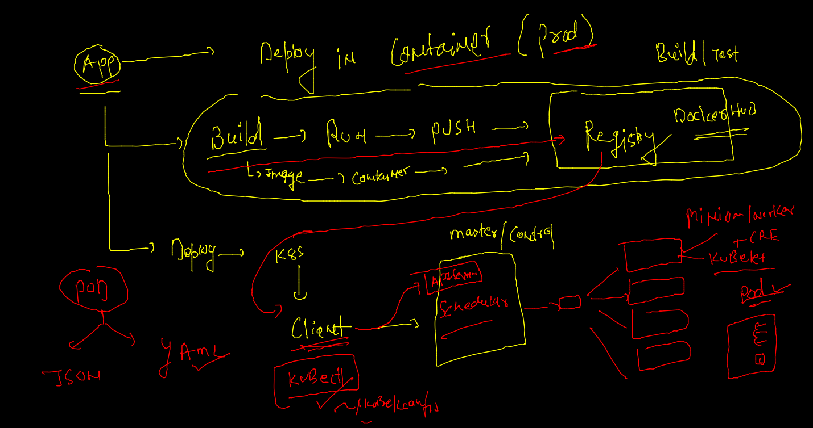

# Plan of traning --


## deploy app in container journey 



### delete all the pods

```
 kubectl  get  pods
NAME          READY   STATUS    RESTARTS      AGE
anilapod-1    1/1     Running   1 (14h ago)   17h
matloob1      1/1     Running   1 (14h ago)   17h
mradulpod-1   1/1     Running   1 (14h ago)   17h
pratpod-1     1/1     Running   1 (14h ago)   17h
rameezpod-1   1/1     Running   1 (14h ago)   17h
wasifpod-1    1/1     Running   1 (14h ago)   17h
 fire@ashutoshhs-MacBook-Air  ~/Desktop  kubectl  delete pods --all
pod "anilapod-1" deleted
pod "matloob1" deleted
pod "mradulpod-1" deleted
pod "pratpod-1" deleted
pod "rameezpod-1" deleted

```

### Docker image build history 

```
379  docker  build  -t  dockerashu/cisco:feb32022   . 
  380  docker ps
  381  docker  run -itd -p 4459:80   dockerashu/cisco:feb32022
  382  docker  ps
  383  docker  run -itd -p 4470:80 -e deploy=app3   dockerashu/cisco:feb32022
  384  history 
  385  docker  ps
  386  docker  exec -it 05b686f6a663  bash 
  387  docker  rm $(docker  ps -aq) -f
  388  cd  webapp/
  389  docker  build  -t  dockerashu/cisco:feb32022   . 
  390  docker  run -itd -p 4470:80  dockerashu/cisco:feb32022
  391  history 
  392  docker  login 
  393  docker push dockerashu/cisco:feb32022
  
```

### COnfigure linux machine as kubernetes client --

```
 mkdir  ~/.kube  
mkdir: cannot create directory ‘/home/ashu/.kube’: File exists
[ashu@ip-172-31-29-84 .kube]$ 
[ashu@ip-172-31-29-84 .kube]$ 
[ashu@ip-172-31-29-84 .kube]$ cd  ~/.kube
[ashu@ip-172-31-29-84 .kube]$ 
[ashu@ip-172-31-29-84 .kube]$ 
[ashu@ip-172-31-29-84 .kube]$ wget  3.233.138.186/admin.conf  ^C
[ashu@ip-172-31-29-84 .kube]$ ls
admin.conf
[ashu@ip-172-31-29-84 .kube]$ mv  admin.conf  config 
[ashu@ip-172-31-29-84 .kube]$ ls
config
[ashu@ip-172-31-29-84 .kube]$ kubectl   get  nodes
NAME         STATUS   ROLES                  AGE   VERSION
masternode   Ready    control-plane,master   20h   v1.23.3
node1        Ready    <none>                 20h   v1.23.3
node2        Ready    <none>                 20h   v1.23.3

```

### Deploy webapp in k8s as POD 

```
 ls
ashucompose  depoyapps  pythonimages  webapp
[ashu@ip-172-31-29-84 myimages]$ cd  depoyapps/
[ashu@ip-172-31-29-84 depoyapps]$ ls
ashuwebpod.yaml
[ashu@ip-172-31-29-84 depoyapps]$ kubectl   apply -f  ashuwebpod.yaml 
pod/ashuwebpod123 created
[ashu@ip-172-31-29-84 depoyapps]$ kubectl   get pods
NAME            READY   STATUS             RESTARTS   AGE
ashuwebpod123   1/1     Running            0          15s
avikpod1        0/1     ImagePullBackOff   0          17s

```

