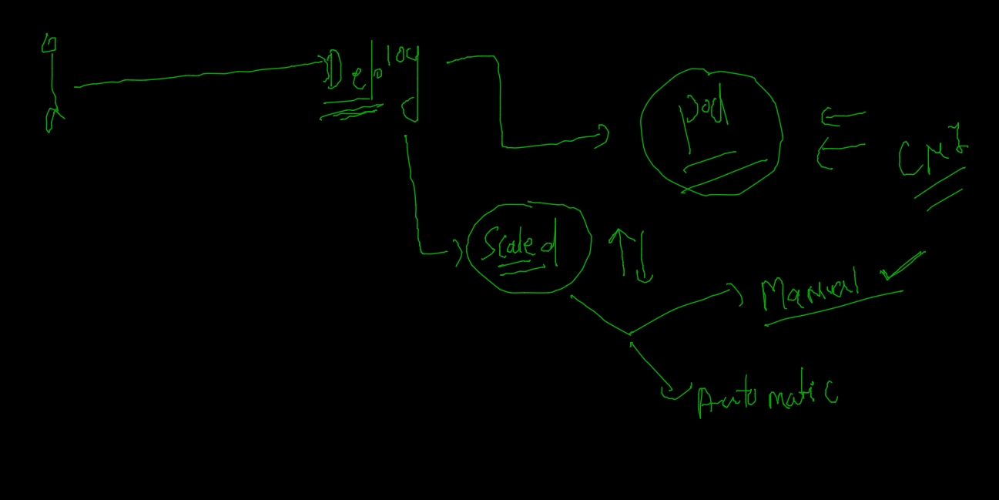
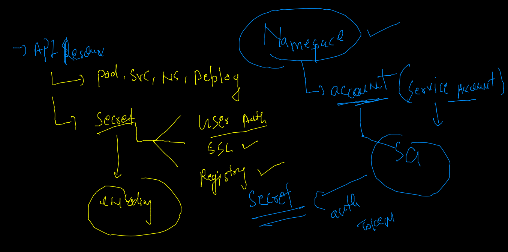

# Plan of traning --


## Deployment 

### creating 
```
kubectl  create deployment  ashuweb  --image=dockerashu/cisco:feb32022  --dry-run=client -o yaml  

```

### deploy yaml and check self healing 

```
 kubectl apply -f  newapp.yaml 
deployment.apps/ashuweb created
[ashu@ip-172-31-29-84 depoyapps]$ kubectl   get deployment 
NAME      READY   UP-TO-DATE   AVAILABLE   AGE
ashuweb   1/1     1            1           5s
[ashu@ip-172-31-29-84 depoyapps]$ kubectl   get deploy
NAME      READY   UP-TO-DATE   AVAILABLE   AGE
ashuweb   1/1     1            1           8s
[ashu@ip-172-31-29-84 depoyapps]$ kubectl   get   pod
NAME                      READY   STATUS    RESTARTS   AGE
ashuweb-87ffb8cb8-zrglc   1/1     Running   0          24s
[ashu@ip-172-31-29-84 depoyapps]$ kubectl   get   pod -o wide
NAME                      READY   STATUS    RESTARTS   AGE   IP                NODE    NOMINATED NODE   READINESS GATES
ashuweb-87ffb8cb8-zrglc   1/1     Running   0          30s   192.168.166.141   node1   <none>           <none>
[ashu@ip-172-31-29-84 depoyapps]$ kubectl  delete pod ashuweb-87ffb8cb8-zrglc
pod "ashuweb-87ffb8cb8-zrglc" deleted
[ashu@ip-172-31-29-84 depoyapps]$ kubectl   get   pod -o wide
NAME                      READY   STATUS    RESTARTS   AGE   IP               NODE    NOMINATED NODE   READINESS GATES
ashuweb-87ffb8cb8-q7sqw   1/1     Running   0          59s   192.168.104.26   node2   <none>           <none>

```

### checking  container ip inside POD 

```
kubectl  exec -it  ashuweb-87ffb8cb8-q7sqw  -- bash 
[root@ashuweb-87ffb8cb8-q7sqw common]# 
[root@ashuweb-87ffb8cb8-q7sqw common]# ifconfig 
eth0: flags=4163<UP,BROADCAST,RUNNING,MULTICAST>  mtu 8981
        inet 192.168.104.26  netmask 255.255.255.255  broadcast 0.0.0.0
        ether e2:77:cf:46:15:e5  txqueuelen 0  (Ethernet)
        RX packets 728  bytes 3570803 (3.4 MiB)
        RX errors 0  dropped 0  overruns 0  frame 0
        TX packets 648  bytes 65441 (63.9 KiB)
        TX errors 0  dropped 0 overruns 0  carrier 0  collisions 0

lo: flags=73<UP,LOOPBACK,RUNNING>  mtu 65536
        inet 127.0.0.1  netmask 255.0.0.0
        loop  txqueuelen 1000  (Local Loopback)
        RX packets 0  bytes 0 (0.0 B)
        RX errors 0  dropped 0  overruns 0  frame 0
        TX packets 0  bytes 0 (0.0 B)
        TX errors 0  dropped 0 overruns 0  carrier 0  collisions 0

[root@ashuweb-87ffb8cb8-q7sqw common]# yum  install net-tools -y

```

### scaling of pod using deployment 



### manual scaling 

```
 kubectl scale deployment   ashuweb  --replicas=3
deployment.apps/ashuweb scaled
[ashu@ip-172-31-29-84 depoyapps]$ kubectl  get pods
NAME                      READY   STATUS    RESTARTS   AGE
ashuweb-87ffb8cb8-8zj5j   1/1     Running   0          13s
ashuweb-87ffb8cb8-lrmk4   1/1     Running   0          13s
ashuweb-87ffb8cb8-q7sqw   1/1     Running   0          9m20s
[ashu@ip-172-31-29-84 depoyapps]$ kubectl  get pods -o wide
NAME                      READY   STATUS    RESTARTS   AGE     IP                NODE    NOMINATED NODE   READINESS GATES
ashuweb-87ffb8cb8-8zj5j   1/1     Running   0          34s     192.168.166.142   node1   <none>           <none>
ashuweb-87ffb8cb8-lrmk4   1/1     Running   0          34s     192.168.135.30    node3   <none>           <none>
ashuweb-87ffb8cb8-q7sqw   1/1     Running   0          9m41s   192.168.104.26    node2   <none>           <none>

```

### all the pods will have same label by deployment 

```
 kubectl  get pods --show-labels
NAME                      READY   STATUS    RESTARTS   AGE     LABELS
ashuweb-87ffb8cb8-8zj5j   1/1     Running   0          4m53s   app=ashuweb,pod-template-hash=87ffb8cb8
ashuweb-87ffb8cb8-lrmk4   1/1     Running   0          4m53s   app=ashuweb,pod-template-hash=87ffb8cb8
ashuweb-87ffb8cb8-q7sqw   1/1     Running   0          14m     app=ashuweb,pod-template-hash=87ffb8cb8

```

### creating service using expose 

```
kubectl  get  deploy 
NAME      READY   UP-TO-DATE   AVAILABLE   AGE
ashuweb   3/3     3            3           17m
[ashu@ip-172-31-29-84 depoyapps]$ 
[ashu@ip-172-31-29-84 depoyapps]$ kubectl  expose  deploy  ashuweb --type NodePort  --port 80 --name  ashusvc1 
service/ashusvc1 exposed
[ashu@ip-172-31-29-84 depoyapps]$ kubectl  get  svc
NAME       TYPE       CLUSTER-IP       EXTERNAL-IP   PORT(S)        AGE
ashusvc1   NodePort   10.107.242.181   <none>        80:32026/TCP   22s

```

### Dashboard deployment in k8s

```
kubectl apply -f https://raw.githubusercontent.com/kubernetes/dashboard/v2.4.0/aio/deploy/recommended.yaml
namespace/kubernetes-dashboard created
serviceaccount/kubernetes-dashboard created

```
### changing service type 

```
kubectl get deploy -n kubernetes-dashboard
NAME                        READY   UP-TO-DATE   AVAILABLE   AGE
dashboard-metrics-scraper   1/1     1            1           68s
kubernetes-dashboard        1/1     1            1           70s
 fire@ashutoshhs-MacBook-Air  ~/Desktop  
 fire@ashutoshhs-MacBook-Air  ~/Desktop  
 fire@ashutoshhs-MacBook-Air  ~/Desktop  
 fire@ashutoshhs-MacBook-Air  ~/Desktop  kubectl get po  -n kubernetes-dashboard
NAME                                         READY   STATUS    RESTARTS   AGE
dashboard-metrics-scraper-799d786dbf-gkfd4   1/1     Running   0          83s
kubernetes-dashboard-6b6b86c4c5-26mqt        1/1     Running   0          84s
 fire@ashutoshhs-MacBook-Air  ~/Desktop  kubectl get svc  -n kubernetes-dashboard
NAME                        TYPE        CLUSTER-IP       EXTERNAL-IP   PORT(S)    AGE
dashboard-metrics-scraper   ClusterIP   10.101.132.132   <none>        8000/TCP   95s
kubernetes-dashboard        ClusterIP   10.97.24.66      <none>        443/TCP    104s
 fire@ashutoshhs-MacBook-Air  ~/Desktop  kubectl edit svc  kubernetes-dashboard    -n kubernetes-dashboard
service/kubernetes-dashboard edited
 fire@ashutoshhs-MacBook-Air  ~/Desktop  kubectl get svc  -n kubernetes-dashboard                         
NAME                        TYPE        CLUSTER-IP       EXTERNAL-IP   PORT(S)         AGE
dashboard-metrics-scraper   ClusterIP   10.101.132.132   <none>        8000/TCP        2m21s
kubernetes-dashboard        NodePort    10.97.24.66      <none>        443:31736/TCP   2m30s

```

### getting dashboard auth token 

### understanding secret 



### getting dashboard secret 

```
 kubectl   get  sa  -n  kubernetes-dashboard
NAME                   SECRETS   AGE
default                1         19m
kubernetes-dashboard   1         19m
[ashu@ip-172-31-29-84 depoyapps]$ kubectl   get  secret  -n  kubernetes-dashboard
NAME                               TYPE                                  DATA   AGE
default-token-mvg7t                kubernetes.io/service-account-token   3      20m
kubernetes-dashboard-certs         Opaque                                0      20m
kubernetes-dashboard-csrf          Opaque                                1      20m
kubernetes-dashboard-key-holder    Opaque                                2      20m
kubernetes-dashboard-token-h9fnq   kubernetes.io/service-account-token   3      20m
[ashu@ip-172-31-29-84 depoyapps]$ kubectl  describe  secret  kubernetes-dashboard-token-h9fnq  -n  kubernetes-dashboard 

```

