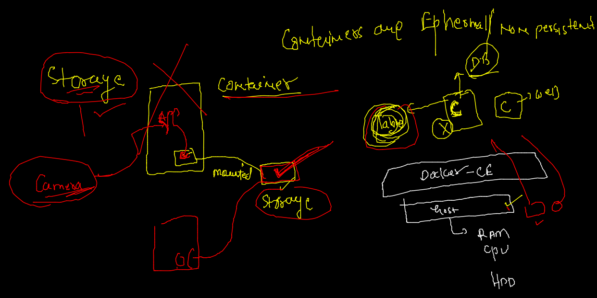
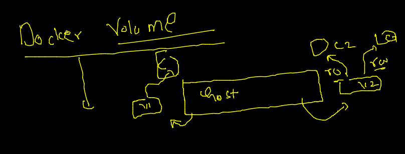
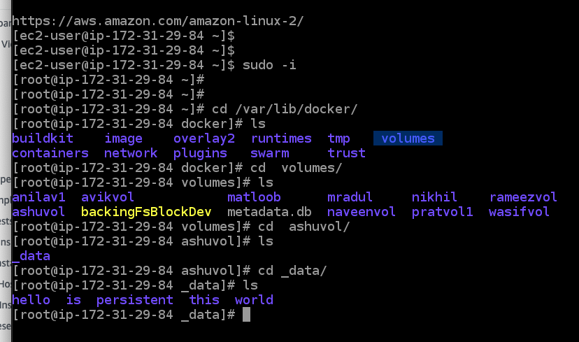
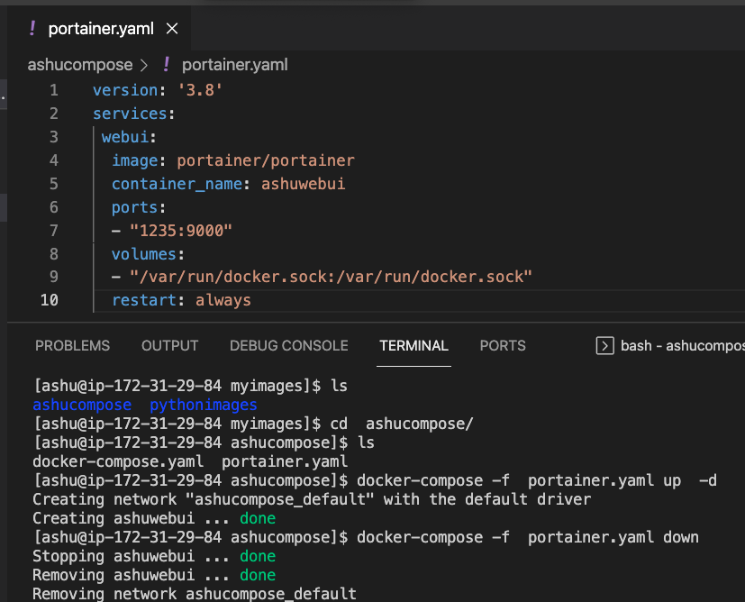
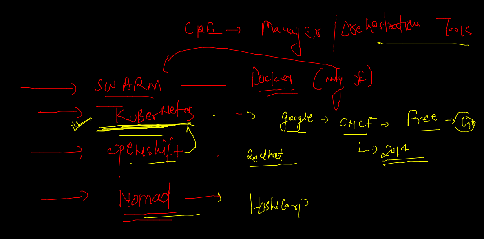
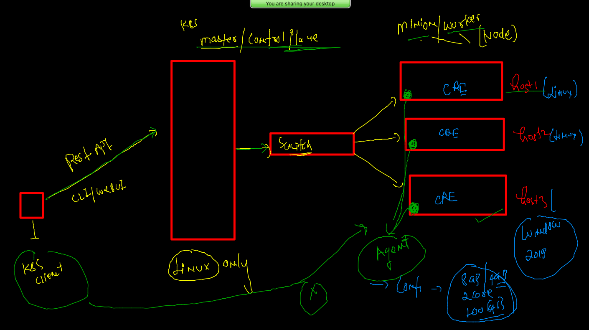
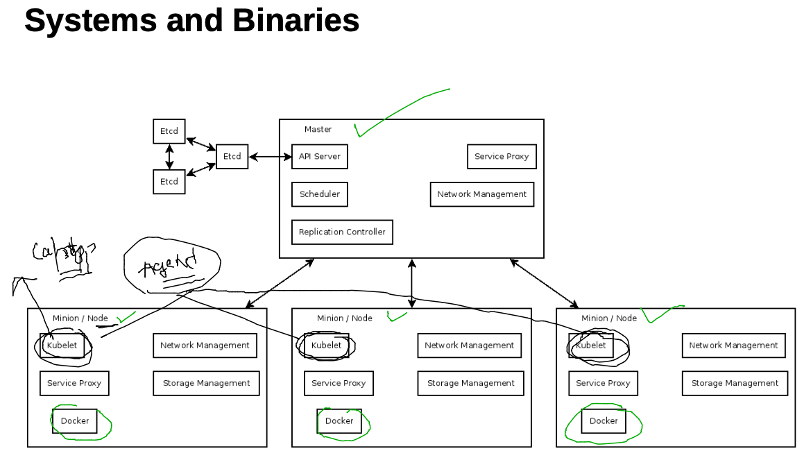
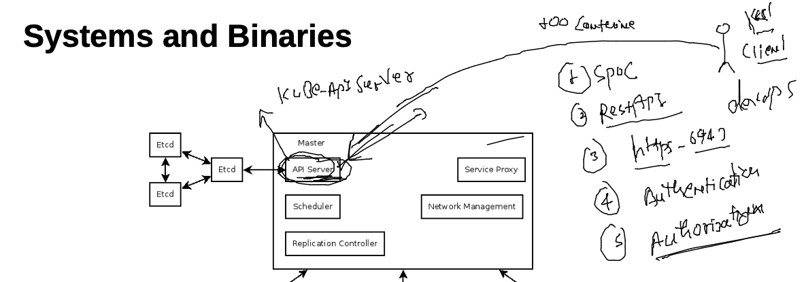
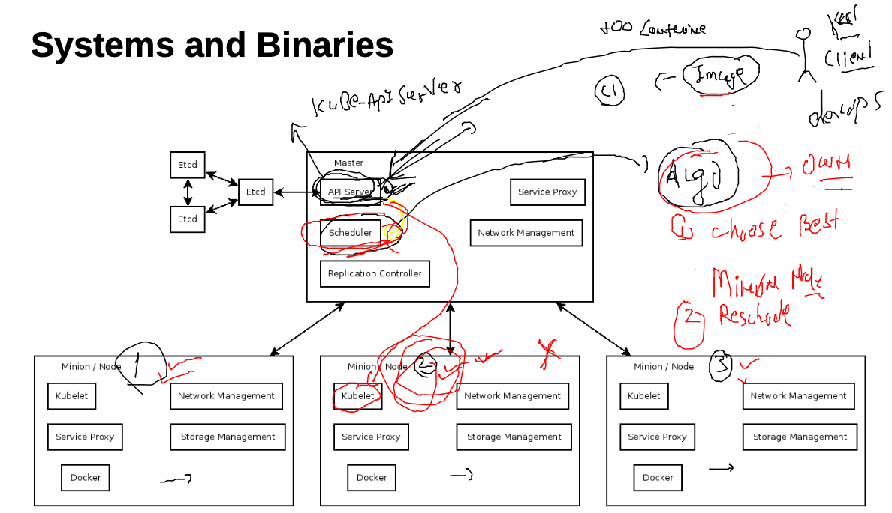
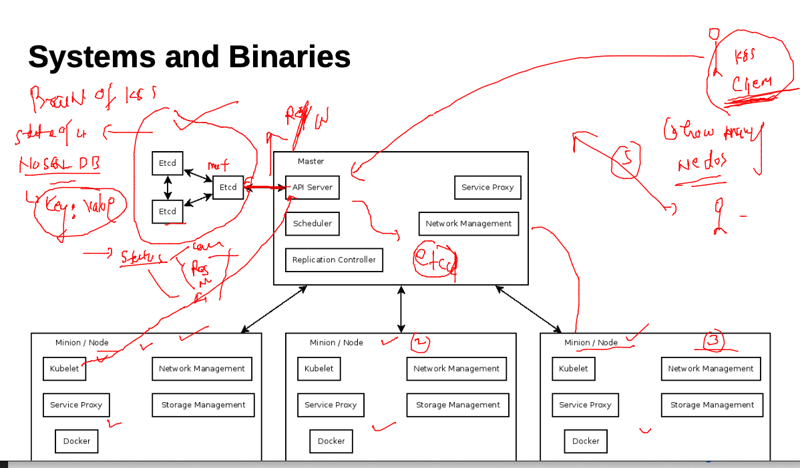

# Plan of traning --


## Storage in Docker 



### docker volume 



### non persistent nature of container --

```
[ashu@ip-172-31-29-84 myimages]$ docker  run -itd --name ashuc1  alpine  
f7bea3a1ceb505706f73b5ed91c36511e5164007cc7cac5fe4f827239f26f70b
[ashu@ip-172-31-29-84 myimages]$ docker  ps
CONTAINER ID   IMAGE     COMMAND     CREATED         STATUS         PORTS     NAMES
f7bea3a1ceb5   alpine    "/bin/sh"   3 seconds ago   Up 2 seconds             ashuc1
[ashu@ip-172-31-29-84 myimages]$ docker  exec -it  ashuc1  sh 
/ # ls
bin    dev    etc    home   lib    media  mnt    opt    proc   root   run    sbin   srv    sys    tmp    usr    var
/ # mkdir  hello world 
/ # ls
bin    etc    home   media  opt    root   sbin   sys    usr    world
dev    hello  lib    mnt    proc   run    srv    tmp    var
/ # exit
[ashu@ip-172-31-29-84 myimages]$ docker  kill  ashuc1 ; docker  rm  ashuc1 
ashuc1
ashuc1
[ashu@ip-172-31-29-84 myimages]$ docker  run -itd --name ashuc1  alpine  
c7cfb36a5d6c836320561db7ed82edbfa690bedb2b65f17ea60a04fa03b37f79
[ashu@ip-172-31-29-84 myimages]$ docker  exec -it  ashuc1  sh 
/ # ls
bin    dev    etc    home   lib    media  mnt    opt    proc   root   run    sbin   srv    sys    tmp    usr    var
/ # exit

```

### creating volume --

```
docker  volume  create  ashuvol 
ashuvol
[ashu@ip-172-31-29-84 myimages]$ docker  volume   ls
DRIVER    VOLUME NAME
local     ashuvol
[ashu@ip-172-31-29-84 myimages]$ docker  volume   ls
DRIVER    VOLUME NAME
local     anilav1
local     ashuvol
local     rameezvol
[ashu@ip-172-31-29-84 myimages]$ docker  volume   inspect  ashuvol 
[
    {
        "CreatedAt": "2022-02-02T05:12:08Z",
        "Driver": "local",
        "Labels": {},
        "Mountpoint": "/var/lib/docker/volumes/ashuvol/_data",
        "Name": "ashuvol",
        "Options": {},
        "Scope": "local"
    }
]

```

### accessing docker volume from backend -- 



### sharing volume to different container at the same time 

```

[ashu@ip-172-31-29-84 myimages]$ docker  run -it --rm   -v  ashuvol:/ok:ro  ubuntu 
Unable to find image 'ubuntu:latest' locally
latest: Pulling from library/ubuntu
08c01a0ec47e: Pull complete 
Digest: sha256:669e010b58baf5beb2836b253c1fd5768333f0d1dbcb834f7c07a4dc93f474be
Status: Downloaded newer image for ubuntu:latest
root@23f04e4ef99b:/# 
root@23f04e4ef99b:/# ls
bin  boot  dev  etc  home  lib  lib32  lib64  libx32  media  mnt  ok  opt  proc  root  run  sbin  srv  sys  tmp  usr  var
root@23f04e4ef99b:/# cd  /ok/
root@23f04e4ef99b:/ok# ls
hello  is  persistent  this  world
root@23f04e4ef99b:/ok# mkdir  new
mkdir: cannot create directory 'new': Read-only file system
root@23f04e4ef99b:/ok# ls
hello  is  persistent  this  world
root@23f04e4ef99b:/ok# rmdir this
rmdir: failed to remove 'this': Read-only file system

```

### attaching multiple volume to containers 

```
 docker  run -it --rm   -v  ashuvol:/ok:ro   -v  ashuvol123:/new:rw      ubuntu 
root@93793c38cc52:/# ls
bin  boot  dev  etc  home  lib  lib32  lib64  libx32  media  mnt  new  ok  opt  proc  root  run  sbin  srv  sys  tmp  usr  var
root@93793c38cc52:/# cd  /new/
root@93793c38cc52:/new# ls
root@93793c38cc52:/new# mkdir hi
root@93793c38cc52:/new# echo hello >a.txt 
root@93793c38cc52:/new# ls
a.txt  hi
root@93793c38cc52:/new# cd /ok/
root@93793c38cc52:/ok# ls
hello  is  persistent  this  world
root@93793c38cc52:/ok# rmdir hello 
rmdir: failed to remove 'hello': Read-only file system
root@93793c38cc52:/ok# exit
exit

```

### host path to container 

```

[ashu@ip-172-31-29-84 myimages]$ docker  run -it --rm   -v  ashuvol:/ok:ro   -v  ashuvol123:/new:rw   -v  /etc:/etc1:ro   ubuntu 
root@68b6f89c1623:/# cd  /etc1/
root@68b6f89c1623:/etc1# ls
DIR_COLORS               cron.monthly       hibagent-config.cfg  man_db.conf        protocols         shells
DIR_COLORS.256color      cron.weekly        hibinit-config.cfg   mke2fs.conf        python            skel
DIR_COLORS.lightbgcolor  crontab            host.conf            modprobe.d         rc.d              ssh
GREP_COLORS              csh.cshrc          hostname             modules-load.d     rc.local          ssl
GeoIP.conf               csh.login          hosts  

```

### webui using portainer 

```
docker  run -itd  --name webui -p 1234:9000  -v  /var/run/docker.sock:/var/run/docker.sock        portainer/portainer
```

### compsoe example for portainer 




### image building using SCM (GIt)

```
 docker  build  -t   dockerashu/tomcat:ciscoapp   https://github.com/redashu/javawebapp.git 
Sending build context to Docker daemon  154.6kB
Step 1/6 : FROM tomcat
latest: Pulling from library/tomcat
0c6b8ff8c37e: Already exists 
412caad352a3: Already exists 
e6d3e61f7a50: Already exists 
461bb1d8c517: Already exists 
e442ee9d8dd9: Pull complete 
542c9fe4a7ba: Pull complete 

```

## Problem with ANY CRE -- docker / containerd / cri-o / rkt 


### container orchestration tools 



# Intro to kubernetes -- k8s 

## Architecture -- 

### infra --



### minion side agent -- kubelet 



### k8s architecture 

### master node / control plane --

## kube-apiserver 



## kube-schedular --



## etcd 




