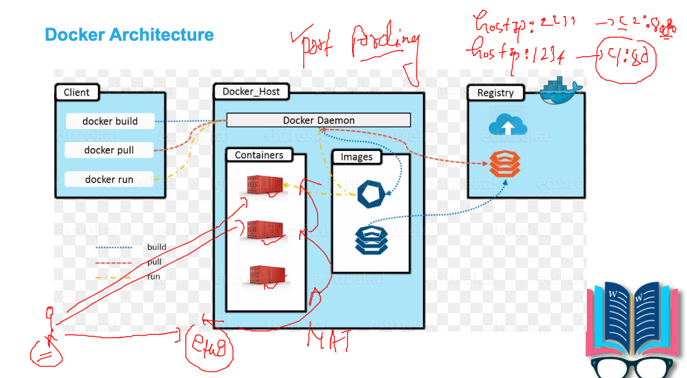
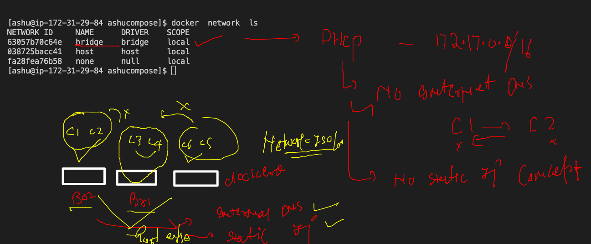

# Plan of traning --


### tip to remove images and containers (ALL)

```
120  docker  rm $(docker ps -qa) -f
  121  docker rmi $(docker  images -q) -f

```

## building docker image --


### image new --

```
cd pythonimages/
[ashu@ip-172-31-29-84 pythonimages]$ ls
cisco.py  Dockerfile
[ashu@ip-172-31-29-84 pythonimages]$ docker build -t ashupython:v1 . 
Sending build context to Docker daemon  3.072kB
Step 1/5 : FROM fedora
 ---> b78af7a83692
Step 2/5 : RUN dnf install python3 -y
 ---> Running in c58458ed9d16
Fedora 35 - x86_64                               18 MB/s |  79 MB     00:04    
Fedora 35 openh264 (From Cisco) - x86_64        7.0 kB/s | 2.5 kB     00:00    
Fedora Modular 35 - x86_64                      8.9 MB/s | 3.3 MB     00:00    
Fedora 35 - x86_64 - Updates                     18 MB/s |  22 MB     00:01    
Fedora Modular 35 - x86_64 - Updates            9.8 MB/s | 2.8 MB     00:00    
Last metadata expiration check: 0:00:01 ago on Tue Feb  1 05:18:18 2022.
Package python3-3.10.0-1.fc35.x86_64 is already installed.
Dependencies resolved.
Nothing to do.
Complete!
Removing intermediate container c58458ed9d16
 ---> 18f3eca86b44
Step 3/5 : RUN mkdir /ashucode
 ---> Running in c7489cf48536
Removing intermediate container c7489cf48536
 ---> b22f648c2a04
Step 4/5 : COPY cisco.py /ashucode/
 ---> c02f956484db
Step 5/5 : CMD ["python3","/ashucode/cisco.py"]
 ---> Running in 5a3cbefb75e2
Removing intermediate container 5a3cbefb75e2
 ---> 2ff68235df68
Successfully built 2ff68235df68
Successfully tagged ashupython:v1

```

### building 

```
$ ls
cisco.py  Dockerfile  official.dockerfile
[ashu@ip-172-31-29-84 pythonimages]$ docker build -t ashupython:v2  -f  official.dockerfile  . 
Sending build context to Docker daemon  4.096kB
Step 1/4 : FROM python
 ---> e2e732b7951f
Step 2/4 : RUN mkdir /ashucode
 ---> Running in a5f194a80464
Removing intermediate container a5f194a80464
 ---> 175e88f6f760
Step 3/4 : COPY cisco.py /ashucode/

```

### creating container --

```
 149  docker run  -it  -d --name  ashupyc1  ashupython:v1  
  150  docker  ps
  151  docker  stats
  152  history 
[ashu@ip-172-31-29-84 pythonimages]$ docker  ps
CONTAINER ID   IMAGE            COMMAND                  CREATED          STATUS          PORTS     NAMES
6cfb0ab04391   anilapython:v2   "python3 /anilacode/…"   8 seconds ago    Up 7 seconds              anila2
10c0405d0900   anilapython:v1   "python3 /anilacode/…"   18 seconds ago   Up 17 seconds             anila1
c0c707e1a321   ashupython:v1    "python3 /ashucode/c…"   38 seconds ago   Up 37 seconds             ashupyc1

```
### images sharing with container registry 


### image format to push in docker hub 


### pushing image to docker hub 

```
[ashu@ip-172-31-29-84 pythonimages]$ docker  images   |  grep -i ashu
ashupython          v2          033a4eb76f0e   About an hour ago   886MB
ashupython          v1          2ff68235df68   About an hour ago   391MB
[ashu@ip-172-31-29-84 pythonimages]$ 
[ashu@ip-172-31-29-84 pythonimages]$ 
[ashu@ip-172-31-29-84 pythonimages]$ docker  tag   ashupython:v1   docker.io/dockerashu/ciscopython:pyfeb12022 
[ashu@ip-172-31-29-84 pythonimages]$ 
[ashu@ip-172-31-29-84 pythonimages]$ 
[ashu@ip-172-31-29-84 pythonimages]$ docker  images   |  grep -i ashu
ashupython               v2           033a4eb76f0e   About an hour ago   886MB
dockerashu/ciscopython   pyfeb12022   2ff68235df68   About an hour ago   391MB
ashupython               v1           2ff68235df68   About an hour ago   391MB
[ashu@ip-172-31-29-84 pythonimages]$ 
[ashu@ip-172-31-29-84 pythonimages]$ docker  login  
Login with your Docker ID to push and pull images from Docker Hub. If you don't have a Docker ID, head over to https://hub.docker.com to create one.
Username: dockerashu
Password: 
WARNING! Your password will be stored unencrypted in /home/ashu/.docker/config.json.
Configure a credential helper to remove this warning. See
https://docs.docker.com/engine/reference/commandline/login/#credentials-store

Login Succeeded
[ashu@ip-172-31-29-84 pythonimages]$ docker  push     dockerashu/ciscopython:pyfeb12022 
The push refers to repository [docker.io/dockerashu/ciscopython]
1828ab6bff53: Pushed 
b623d36cc2bd: Pushed 
f0ea5f780d7c: Pushed 
389adea752cd: Mounted from library/fedora 
pyfeb12022: digest: sha256:6db5b0efe8fb3ce7d83b4a0b0d0597864c327e0c3ddb172ce62ab4179b8b90c3 size: 1156
[ashu@ip-172-31-29-84 pythonimages]$ 
[ashu@ip-172-31-29-84 pythonimages]$ docker  logout 
Removing login credentials for https://index.docker.io/v1/

```

### pulling image from a different docker client -

```

 fire@ashutoshhs-MacBook-Air  ~  docker  pull  dockerashu/ciscopython:pyfeb12022 
pyfeb12022: Pulling from dockerashu/ciscopython
edad61c68e67: Extracting  8.356MB/54.65MB
9504d90bef65: Downloading  87.02MB/190MB
b128e8c540e3: Download complete 
88df88746666: Download complete 


```

## Docker compose -- 


## installation --

[compsoe install](https://docs.docker.com/compose/install/)

### compsoe file 1


### running compose file 

```

[ashu@ip-172-31-29-84 myimages]$ cd  ashucompose/
[ashu@ip-172-31-29-84 ashucompose]$ ls
docker-compose.yaml
[ashu@ip-172-31-29-84 ashucompose]$ docker-compose  up  -d 
Creating network "ashucompose_default" with the default driver
Creating ashuc123 ... done
[ashu@ip-172-31-29-84 ashucompose]$ docker-compose  ps
  Name       Command     State   Ports
--------------------------------------
ashuc123   ping fb.com   Up           
[ashu@ip-172-31-29-84 ashucompose]$ docker-compose images
Container   Repository    Tag       Image Id       Size  
---------------------------------------------------------
ashuc123    alpine       latest   c059bfaa849c   5.586 MB

```

### compose more commands 

```
197  docker-compose  up  -d 
  198  docker-compose  ps
  199  docker-compose images
  200  docker-compose  ps
  201  ls
  202  docker-compose  stop
  203  docker-compose  ps
  204  docker-compose  start
  205  docker-compose  ps
  206  history 
[ashu@ip-172-31-29-84 ashucompose]$ ls
docker-compose.yaml
[ashu@ip-172-31-29-84 ashucompose]$ docker-compose  ps
  Name       Command     State   Ports
--------------------------------------
ashuc123   ping fb.com   Up           
[ashu@ip-172-31-29-84 ashucompose]$ docker-compose  stop
Stopping ashuc123 ... done
[ashu@ip-172-31-29-84 ashucompose]$ docker-compose  rm
Going to remove ashuc123
Are you sure? [yN] y
Removing ashuc123 ... done

```

### up and down 

```
 
[ashu@ip-172-31-29-84 ashucompose]$ docker-compose up -d
Creating network "ashucompose_default" with the default driver
Creating ashuc123 ... done
[ashu@ip-172-31-29-84 ashucompose]$ 
[ashu@ip-172-31-29-84 ashucompose]$ 
[ashu@ip-172-31-29-84 ashucompose]$ docker-compose  down 
Stopping ashuc123 ... done
Removing ashuc123 ... done
Removing network ashucompose_default

```

### compose example --

```
version: '3.8'
services:
 ashuapp3:
  image: ashupython:v1111
  build:
   context: ../pythonimages
   dockerfile: alpine.dockerfile
  container_name: ashualpc11
  
 ashuapp2: 
  image: ashupython:v1
  container_name: ashupyc11

 ashuapp1: # this is myfirst container app
  image: alpine
  container_name: ashuc123
  command: ping fb.com 


# docker run -itd --name ashuc123 alpine ping fb.com 

```

## Docker Networking --

### Default network bridge 

```
 docker  network  ls
NETWORK ID     NAME      DRIVER    SCOPE
63057b70c64e   bridge    bridge    local
038725bacc41   host      host      local
fa28fea76b58   none      null      local
[ashu@ip-172-31-29-84 ashucompose]$ docker  network  inspect  63057b70c64e
[
    {
        "Name": "bridge",
        "Id": "63057b70c64e625d8733055aa128a3d331b9e2d5838f444a391c85cff73abe8f",
        "Created": "2022-02-01T04:04:41.669566334Z",
        "Scope": "local",
        "Driver": "bridge",
        "EnableIPv6": false,
        "IPAM": {

```
### checking ip address of container 

```
docker  inspect  ashuc1  |  grep -i ipaddress
            "SecondaryIPAddresses": null,
            "IPAddress": "172.17.0.2",
                    "IPAddress": "172.17.0.2",
                    
```

### check container network details from inside 

```
[ashu@ip-172-31-29-84 ashucompose]$ docker exec -it  ashuc1  sh 
/ # ifconfig 
eth0      Link encap:Ethernet  HWaddr 02:42:AC:11:00:02  
          inet addr:172.17.0.2  Bcast:172.17.255.255  Mask:255.255.0.0
          UP BROADCAST RUNNING MULTICAST  MTU:1500  Metric:1
          RX packets:13 errors:0 dropped:0 overruns:0 frame:0
          TX packets:0 errors:0 dropped:0 overruns:0 carrier:0
          collisions:0 txqueuelen:0 
          RX bytes:1070 (1.0 KiB)  TX bytes:0 (0.0 B)

lo        Link encap:Local Loopback  
          inet addr:127.0.0.1  Mask:255.0.0.0
          UP LOOPBACK RUNNING  MTU:65536  Metric:1
          RX packets:0 errors:0 dropped:0 overruns:0 frame:0
          TX packets:0 errors:0 dropped:0 overruns:0 carrier:0
          collisions:0 txqueuelen:1000 
          RX bytes:0 (0.0 B)  TX bytes:0 (0.0 B)

/ # route  -n
Kernel IP routing table
Destination     Gateway         Genmask         Flags Metric Ref    Use Iface
0.0.0.0         172.17.0.1      0.0.0.0         UG    0      0        0 eth0
172.17.0.0      0.0.0.0         255.255.0.0     U     0      0        0 eth0

```

### checking routing table --

```
 route  -n
Kernel IP routing table
Destination     Gateway         Genmask         Flags Metric Ref    Use Iface
0.0.0.0         172.17.0.1      0.0.0.0         UG    0      0        0 eth0
172.17.0.0      0.0.0.0         255.255.0.0     U     0      0        0 eth0

```


### port forwarding in docker container 



### port forwarding --

```
docker run -itd  --name ashuwebc2  -p  8876:80  nginx 
00b739a75c655f0808d453cae6cba2d02ca3bee25bf6616824358bef7c89ab00
[ashu@ip-172-31-29-84 ashucompose]$ docker  ps
CONTAINER ID   IMAGE     COMMAND                  CREATED          STATUS          PORTS                                               NAMES
00b739a75c65   nginx     "/docker-entrypoint.…"   5 seconds ago    Up 4 seconds    0.0.0.0:8876->80/tcp, :::8876->80/tcp               ashuwebc2
a5af0ba776a8   nginx     "/docker-entrypoint.…"   27 seconds ago   Up 26 seconds   80/tcp, 0.0.0.0:1235->8080/tcp, :::1235->8080/tcp   avikc2
dd5fc4bc960c   nginx     "/docker-entrypoint.…"   33 seconds ago   Up 33 seconds   0.0.0.0:1234->80/tcp, :::1234->80/tcp               naveenwebc1

```

### Container with no network 

```
[ashu@ip-172-31-29-84 ashucompose]$ docker  network  ls
NETWORK ID     NAME      DRIVER    SCOPE
63057b70c64e   bridge    bridge    local
038725bacc41   host      host      local
fa28fea76b58   none      null      local
[ashu@ip-172-31-29-84 ashucompose]$ docker  run -itd  --name ashunoet1  --network none  alpine 
1b980ced391b43f0fdfed2f2b727a019987bf753bcc9932c2b49188c8af43921
[ashu@ip-172-31-29-84 ashucompose]$ docker  exec -it ashunoet1  sh
/ # ifconfig 
lo        Link encap:Local Loopback  
          inet addr:127.0.0.1  Mask:255.0.0.0
          UP LOOPBACK RUNNING  MTU:65536  Metric:1
          RX packets:0 errors:0 dropped:0 overruns:0 frame:0
          TX packets:0 errors:0 dropped:0 overruns:0 carrier:0
          collisions:0 txqueuelen:1000 
          RX bytes:0 (0.0 B)  TX bytes:0 (0.0 B)

/ # ping google.com 
ping: bad address 'google.com'
/ # 

```

### Host network bridge 

```
]$ docker run -it --rm  --network host  alpine  sh 
/ # ifconfig 
docker0   Link encap:Ethernet  HWaddr 02:42:19:F5:4D:80  
          inet addr:172.17.0.1  Bcast:172.17.255.255  Mask:255.255.0.0
          inet6 addr: fe80::42:19ff:fef5:4d80/64 Scope:Link
          UP BROADCAST MULTICAST  MTU:1500  Metric:1
          RX packets:64884 errors:0 dropped:0 overruns:0 frame:0
          TX packets:82917 errors:0 dropped:0 overruns:0 carrier:0
          collisions:0 txqueuelen:0 
          RX bytes:64285531 (61.3 MiB)  TX bytes:579818564 (552.9 MiB)

eth0      Link encap:Ethernet  HWaddr 0A:3C:7E:6E:6D:D3  
          inet addr:172.31.29.84  Bcast:172.31.31.255  Mask:255.255.240.0
          inet6 addr: fe80::83c:7eff:fe6e:6dd3/64 Scope:Link
          UP BROADCAST RUNNING MULTICAST  MTU:9001  Met
          
```

### Bridge 



### docker custom bridges --

```
 280  docker  network  create  ashubr1
  281  docker  network  ls
  282  docker  network  inspect  ashubr1
  283  history 
[ashu@ip-172-31-29-84 ashucompose]$ docker  network  create  ashubr2  --subnet 192.169.100.0/24  
12358bcbba665af650d2dada0cb50a5e9091e39bd4184ee6dc18dbec4d74722a
[ashu@ip-172-31-29-84 ashucompose]$ docker  network  ls
NETWORK ID     NAME       DRIVER    SCOPE
3cc14eeb06c7   anilabr1   bridge    local
77eb6910e202   ashubr1    bridge    local
12358bcbba66   ashubr2    bridge    local
63057b70c64e   bridge     bridge    local
038725bacc41   host       host      local
fa28fea76b58   none       null      local
[ashu@ip-172-31-29-84 ashucompose]$ docker  run -itd  --name ashuc11  --network ashubr1  alpine  
77fbf870512624f1d40dd4416a8384d3bba27f750d436984685ab44a5d573e96
[ashu@ip-172-31-29-84 ashucompose]$ docker  run -itd  --name ashuc22  --network ashubr2  alpine  
cf4242386265551e3e78ab04199aa85cad37eda243516e46b89069c8a69119d1
[ashu@ip-172-31-29-84 ashucompose]$ 
[ashu@ip-172-31-29-84 ashucompose]$ docker  run -itd  --name ashuc33  --network ashubr2 --ip 192.169.100.200  alpine  
a3bf5243ca2fde1b06113e211f5ae9561f1616f7fcefdf75930be23a2d7687c7
[ashu@ip-172-31-29-84 ashucompose]$ docker exec  -it ashuc33 sh 
/ # ifconfig 
eth0      Link encap:Ethernet  HWaddr 02:42:C0:A9:64:C8  
          inet addr:192.169.100.200  Bcast:192.169.100.255  Mask:255.255.255.0
          UP BROADCAST RUNNING MULTICAST  MTU:1500  Metric:1
          RX packets:7 errors:0 dropped:0 overruns:0 frame:0
          TX packets:0 errors:0 dropped:0 overruns:0 carrier:0
          collisions:0 txqueuelen:0 
          RX bytes:570 (570.0 B)  TX bytes:0 (0.0 B)

lo        Link encap:Local Loopback  
          inet addr:127.0.0.1  Mask:255.0.0.0
          UP LOOPBACK RUNNING  MTU:65536  Metric:1
          RX packets:0 errors:0 dropped:0 overruns:0 frame:0
          TX packets:0 errors:0 dropped:0 overruns:0 carrier:0
          collisions:0 txqueuelen:1000 
          RX bytes:0 (0.0 B)  TX bytes:0 (0.0 B)

/ # ping ashuc22
PING ashuc22 (192.169.100.2): 56 data bytes
64 bytes from 192.169.100.2: seq=0 ttl=64 time=0.188 ms
64 bytes from 192.169.100.2: seq=1 ttl=64 time=0.082 ms
64 bytes from 192.169.100.2: seq=2 ttl=64 time=0.089 ms
^C
--- ashuc22 ping statistics ---
3 packets transmitted, 3 packets received, 0% packet loss
round-trip min/avg/max = 0.082/0.119/0.188 ms
/ # ping  ashuc11
ping: bad address 'ashuc11'
/ # 

```


