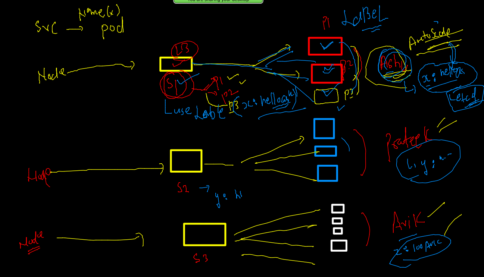

# Plan of traning --


## deploy app in container journey 


### delete all the pods

```
 kubectl  get  pods
NAME          READY   STATUS    RESTARTS      AGE
anilapod-1    1/1     Running   1 (14h ago)   17h
matloob1      1/1     Running   1 (14h ago)   17h
mradulpod-1   1/1     Running   1 (14h ago)   17h
pratpod-1     1/1     Running   1 (14h ago)   17h
rameezpod-1   1/1     Running   1 (14h ago)   17h
wasifpod-1    1/1     Running   1 (14h ago)   17h
 fire@ashutoshhs-MacBook-Air  ~/Desktop  kubectl  delete pods --all
pod "anilapod-1" deleted
pod "matloob1" deleted
pod "mradulpod-1" deleted
pod "pratpod-1" deleted
pod "rameezpod-1" deleted

```

### Docker image build history 

```
379  docker  build  -t  dockerashu/cisco:feb32022   . 
  380  docker ps
  381  docker  run -itd -p 4459:80   dockerashu/cisco:feb32022
  382  docker  ps
  383  docker  run -itd -p 4470:80 -e deploy=app3   dockerashu/cisco:feb32022
  384  history 
  385  docker  ps
  386  docker  exec -it 05b686f6a663  bash 
  387  docker  rm $(docker  ps -aq) -f
  388  cd  webapp/
  389  docker  build  -t  dockerashu/cisco:feb32022   . 
  390  docker  run -itd -p 4470:80  dockerashu/cisco:feb32022
  391  history 
  392  docker  login 
  393  docker push dockerashu/cisco:feb32022
  
```

### COnfigure linux machine as kubernetes client --

```
 mkdir  ~/.kube  
mkdir: cannot create directory ‘/home/ashu/.kube’: File exists
[ashu@ip-172-31-29-84 .kube]$ 
[ashu@ip-172-31-29-84 .kube]$ 
[ashu@ip-172-31-29-84 .kube]$ cd  ~/.kube
[ashu@ip-172-31-29-84 .kube]$ 
[ashu@ip-172-31-29-84 .kube]$ 
[ashu@ip-172-31-29-84 .kube]$ wget  3.233.138.186/admin.conf  ^C
[ashu@ip-172-31-29-84 .kube]$ ls
admin.conf
[ashu@ip-172-31-29-84 .kube]$ mv  admin.conf  config 
[ashu@ip-172-31-29-84 .kube]$ ls
config
[ashu@ip-172-31-29-84 .kube]$ kubectl   get  nodes
NAME         STATUS   ROLES                  AGE   VERSION
masternode   Ready    control-plane,master   20h   v1.23.3
node1        Ready    <none>                 20h   v1.23.3
node2        Ready    <none>                 20h   v1.23.3

```

### Deploy webapp in k8s as POD 

```
 ls
ashucompose  depoyapps  pythonimages  webapp
[ashu@ip-172-31-29-84 myimages]$ cd  depoyapps/
[ashu@ip-172-31-29-84 depoyapps]$ ls
ashuwebpod.yaml
[ashu@ip-172-31-29-84 depoyapps]$ kubectl   apply -f  ashuwebpod.yaml 
pod/ashuwebpod123 created
[ashu@ip-172-31-29-84 depoyapps]$ kubectl   get pods
NAME            READY   STATUS             RESTARTS   AGE
ashuwebpod123   1/1     Running            0          15s
avikpod1        0/1     ImagePullBackOff   0          17s

```

### generate yaml / json using cli 

```
 kubectl  run   hellopod --image=dockerashu/cisco:feb32022  --port 80 --dry-run=client -o yaml 
apiVersion: v1
kind: Pod
metadata:
  creationTimestamp: null
  labels:
    run: hellopod
  name: hellopod
spec:
  containers:
  - image: dockerashu/cisco:feb32022
    name: hellopod
    ports:
    - containerPort: 80
    resources: {}
  dnsPolicy: ClusterFirst
  restartPolicy: Always
status: {}


```

### JSON 

```
kubectl  run   hellopod --image=dockerashu/cisco:feb32022  --port 80 --dry-run=client -o json 
{
    "kind": "Pod",
    "apiVersion": "v1",

```

### save output in a file 

```
426  kubectl  run   hellopod --image=dockerashu/cisco:feb32022  --port 80 --dry-run=client -o yaml   >autopod.yaml 
  427  kubectl  run   hellopod --image=dockerashu/cisco:feb32022  --port 80 --dry-run=client -o json   >webpod.json 
  
```

### deploy pod using auto gen yaml 

```
 403  ls
[ashu@ip-172-31-29-84 depoyapps]$ ls
ashuwebpod.yaml  autopod.yaml  webpod.json
[ashu@ip-172-31-29-84 depoyapps]$ kubectl apply -f  autopod.yaml 
pod/hellopod created
[ashu@ip-172-31-29-84 depoyapps]$ kubectl  get pods
NAME       READY   STATUS    RESTARTS   AGE
hellopod   1/1     Running   0          4s
[ashu@ip-172-31-29-84 depoyapps]$ 
```

## K8s Networking --

### Host level Networking --


## POD networking is maintained by CNI --plugins -- we are using calico CNI 


### CNM / CNI 


### Internal LB by k8s 


### Deep net 


## Service Intro in k8s 


### service will use label to find respected PODs 



### pods labels 


## service type in k8s 


### Nodeport service in k8s


### creating service of Nodeport type

```
 kubectl   create  service  
Create a service using a specified subcommand.

Aliases:
service, svc

Available Commands:
  clusterip    Create a ClusterIP service
  externalname Create an ExternalName service
  loadbalancer Create a LoadBalancer service
  nodeport     Create a NodePort service
  
  
  ====
  
  
  kubectl   create  service  nodeport   ashusvc1  --tcp  1234:80   --dry-run=client -o yaml   
apiVersion: v1
kind: Service
metadata:
  creationTimestamp: null
  labels:
    app: ashusvc1
  name: ashusvc1
spec:
  ports:
  - name: 1234-80
    port: 1234
    protocol: TCP
    targetPort: 80
  selector:
    app: ashusvc1
  type: NodePort
status:
  loadBalancer: {}
[ashu@ip-172-31-29-84 depoyapps]$ kubectl   create  service  nodeport   ashusvc1  --tcp  1234:80   --dry-run=client -o yaml >svc1.yaml  

```

### creating service THe INternal LB 

```
$ cd  depoyapps/
[ashu@ip-172-31-29-84 depoyapps]$ ls
ashuwebpod.yaml  autopod.yaml  svc1.yaml  webpod.json
[ashu@ip-172-31-29-84 depoyapps]$ kubectl  apply -f svc1.yaml 
service/ashusvc1 created
[ashu@ip-172-31-29-84 depoyapps]$ kubectl   get  service
NAME         TYPE        CLUSTER-IP       EXTERNAL-IP   PORT(S)          AGE
ashusvc1     NodePort    10.111.240.227   <none>        1234:32086/TCP   23s
kubernetes   ClusterIP   10.96.0.1        <none>        443/TCP          24h
[ashu@ip-172-31-29-84 depoyapps]$ 

```

