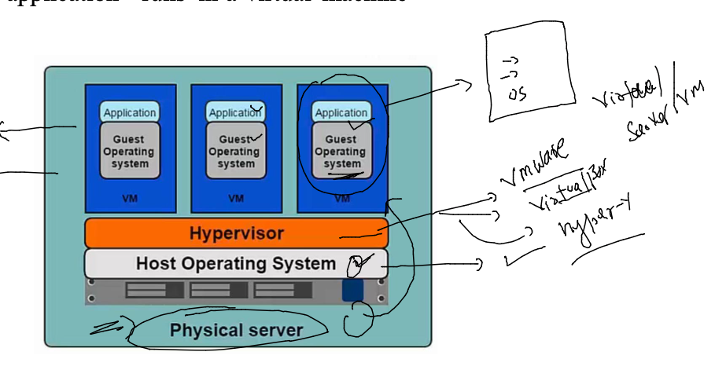
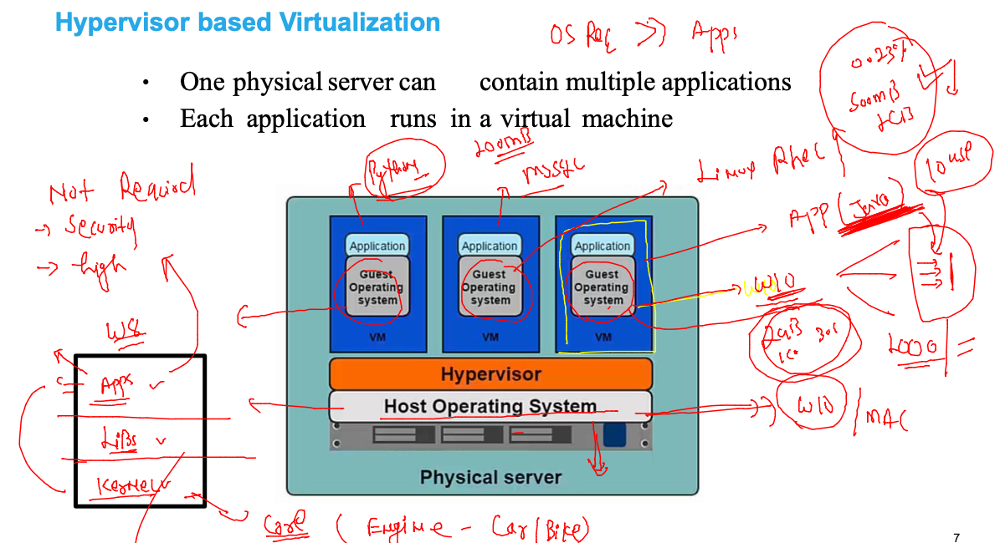

# Plan of traning --


## In past problems in app testing and deployment 

### when apps are not compatible --


### solution to bare-metal server



### vm problem with entire OS 



## Intro to Container and CRE 


## container --


### Docker engine only can use LInux and windows kernel 


## Docker Desktop 


### Docker client and Docker server 


### Docker server and client again 


### Docker images storage


## Docker client side OPerations ---

###  search --

```
 docker  search   java
NAME                               DESCRIPTION                                     STARS     OFFICIAL   AUTOMATED
node                               Node.js is a JavaScript-based platform for s…   11070     [OK]       
tomcat                             Apache Tomcat is an open source implementati…   3248      [OK]       
openjdk                            OpenJDK is an open-source implementation of …   3134      [OK]       
java                               DEPRECATED; use "openjdk" (or other JDK impl…   1976      [OK]       
ghost                              Ghost is a free and open source blogging pla…   

```

### docker image pull 

```
$ docker  images
REPOSITORY   TAG       IMAGE ID   CREATED   SIZE
[ashu@ip-172-31-29-84 ~]$ docker  pull  python 
Using default tag: latest
latest: Pulling from library/python
0c6b8ff8c37e: Pull complete 
412caad352a3: Pull complete 
e6d3e61f7a50: Pull complete 
461bb1d8c517: Pull complete 
808edda3c2e8: Pull complete 
724cfd2dc19b: Pull complete 
8bd4965a24ab: Pull complete 
fccd5fa208a8: Pull complete 
af1ca64a0eec: Pull complete 
Digest: sha256:a7a73f894e756267b2bac3b068e51ad50aa06f16855a9c6b208630d48937796f
Status: Downloaded newer image for python:latest
docker.io/library/python:latest
[ashu@ip-172-31-29-84 ~]$ docker  images
REPOSITORY   TAG       IMAGE ID       CREATED      SIZE
python       latest    e2e732b7951f   2 days ago   886MB

```

### Remove image

```
]$ docker  rmi   e2e732b7951f
Untagged: python:latest
Untagged: python@sha256:a7a73f894e756267b2bac3b068e51ad50aa06f16855a9c6b208630d48937796f
Deleted: sha256:e2e732b7951fb02a92d6687dea6489e410226ea213c130e8fd6a9bac5bd58a75
Deleted: sha256:ea0cb2124f6f738b14c549f402ccaf32c7faa6271036b6befea60690cb576e6c
Deleted: sha256:394f3b5c78c0f14ae8e11fa9fa06d07f16ec8dd2c6f301a0a061b94cc9f8ea43
Deleted: sha256:16de92d6ca8a76b02662cd56e1cb12d1fadc9a37acb4a3158807fb5ff60cc409
Deleted: sha256:ebc6bec13fb499692864e3733f56768d82ed848ce8431f2d164cd7c855994d69
Deleted: sha256:c9d83dfef3221e0c75a600e693989239ffc9a4c6182a7352a1d5d7c3f2187ef9
Deleted: sha256:6272ab69c1d23c955c3f4bcb2b4139860bf559d0082f6a7d7615aacd65aaee3a
Deleted: sha256:4315d8ceb1437656da3159731e7ec1da348f6f10042b8235d0feee8b30094004
Deleted: sha256:a8c4eed47317f7af735a31e45799a7ec56d4021bb5c7c30fa113eca93399ed6a
Deleted: sha256:0b0f2f2f52795d31dd1107e7ac81adca6aa51769f6ec4e23f745e373ae588995
[ashu@ip-172-31-29-84 ~]$ docker images
REPOSITORY   TAG       IMAGE ID       CREATED        SIZE
mysql        latest    d1dc36cf8d9e   4 days ago     519MB
alpine       latest    c059bfaa849c   2 months ago   5.59MB
centos       latest    5d0da3dc9764   4 months ago   231MB

```

### pulling particular version of image

```

[ashu@ip-172-31-29-84 ~]$ docker  pull  python:3.7-buster
3.7-buster: Pulling from library/python
a024302f8a01: Pull complete 
289773030fdc: Pull complete 
81bb8b3399fe: Pull complete 
9c63da771697: Pull complete 
bcf1b23b1e4b: Pull complete 
8dfb70f2242f: Pull complete 
bc344f81e96f: Pull complete 
2129a9155f08: Pull complete 
f0788bcb508b: Pull complete 
Digest: sha256:e0beed41238fa165091cfeb1c24c0985667f41a995a8ad6d7d99fe4a1e549117
Status: Downloaded newer image for python:3.7-buster
docker.io/library/python:3.7-buster
[ashu@ip-172-31-29-84 ~]$ docker  images
REPOSITORY   TAG          IMAGE ID       CREATED        SIZE
python       3.7-buster   3bfd77c4295d   2 days ago     853MB

```

### in linux host --- docker directory structure 


```
 
[root@ip-172-31-29-84 ~]# cd  /var/lib/
[root@ip-172-31-29-84 lib]# ls
alternatives  cloud       docker         initramfs  mlocate    postfix    rsyslog      xfsdump
amazon        containerd  games          logrotate  nfs        rpcbind    stateless    yum
authconfig    dbus        gssproxy       machines   os-prober  rpm        systemd
chrony        dhclient    hibinit-agent  misc       plymouth   rpm-state  update-motd
[root@ip-172-31-29-84 lib]# cd  docker/
[root@ip-172-31-29-84 docker]# ls
buildkit  containers  image  network  overlay2  plugins  runtimes  swarm  tmp  trust  volumes
[root@ip-172-31-29-84 docker]# 

```

### Docker final 


### creating container --


### alpine container --


##==

```
docker  run  -d  --name  ashuc1  alpine  ping  google.com 
2de7b6da5c9591f597eae396a02599ac3a602ef069b4e657c6c004215cdee196
[ashu@ip-172-31-29-84 ~]$ docker  ps
CONTAINER ID   IMAGE     COMMAND             CREATED          STATUS          PORTS     NAMES
2de7b6da5c95   alpine    "ping google.com"   11 seconds ago   Up 9 seconds              ashuc1
d88e17a16218   alpine    "ping google.com"   44 seconds ago   Up 42 seconds             matloob

```

### list of running container --
```
docker  ps
CONTAINER ID   IMAGE     COMMAND                CREATED         STATUS         PORTS     NAMES
fcbc3f2b805a   alpine    "ping google.com"      3 minutes ago   Up 3 minutes             rameez01
c5d4d6b2bf53   alpine    "ping gmail.com"       3 minutes ago   Up 3 minutes             anila2
88d8eb17c3e0   centos    "ping www.cisco.com"   3 minutes ago   Up 3 minutes             nikhil
f5d0f2540f31   alpine    "ping google.com"      4 minutes ago   Up 4 minutes             anila1
a9496982ddd2   alpine    "ping google.com"      4 minutes ago   Up 4 minutes             prateek
```

### to check output container process

```
 46  docker  logs  ashuc1 
   47  docker  logs -f  ashuc1 
```

### stop a container 

```
docker  stop  ashuc1 
ashuc1
```

### start the container --

```
docker  start  ashuc1 
ashuc1

```

### access the container shell 

```
 
[ashu@ip-172-31-29-84 ~]$ docker exec  -it  ashuc1  sh 
/ # 
/ # 
/ # whoami
root
/ # ls 
bin    dev    etc    home   lib    media  mnt    opt    proc   root   run    sbin   srv    sys    tmp    usr    var
/ # ifconfig 
eth0      Link encap:Ethernet  HWaddr 02:42:AC:11:00:07  
          inet addr:172.17.0.7  Bcast:172.17.255.255  Mask:255.255.0.0
          UP BROADCAST RUNNING MULTICAST  MTU:1500  Metric:1
          RX packets:137 errors:0 dropped:0 overruns:0 frame:0
          TX packets:126 errors:0 dropped:0 overruns:0 carrier:0
          collisions:0 txqueuelen:0 
          RX bytes:12794 (12.4 KiB)  TX bytes:11956 (11.6 KiB)

lo        Link encap:Local Loopback  
          inet addr:127.0.0.1  Mask:255.0.0.0
          UP LOOPBACK RUNNING  MTU:65536  Metric:1
          RX packets:0 errors:0 dropped:0 overruns:0 frame:0
          TX packets:0 errors:0 dropped:0 overruns:0 carrier:0
          collisions:0 txqueuelen:1000 
          RX bytes:0 (0.0 B)  TX bytes:0 (0.0 B)

/ # exit

```

### remove container 

```
$ docker  stop ashuc1
ashuc1
[ashu@ip-172-31-29-84 ~]$ docker  rm  ashuc1
ashuc1

```
